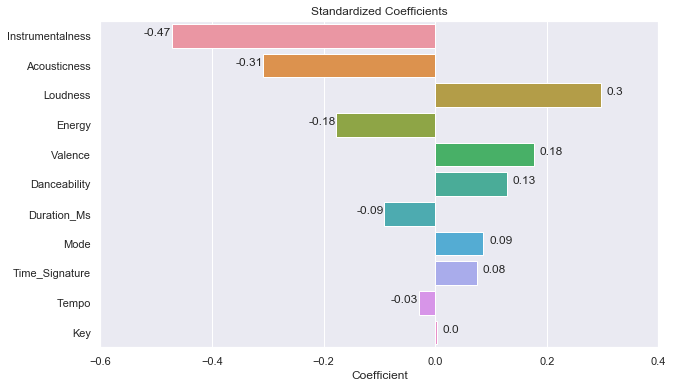

# Inferential Statistics

The section on inferential statistics is looking at statistical significance on observations made and thoughts had during the EDA. This is an essential step to understanding whether or not the differences between hits and non-hits are factual or just happened by chance.

The focus for us lies on three categories:
- Distribution between Hits and Non-Hits
- Correlation with the Target Variable (i.e. hit or non-hit)
- Collinearity between features

# Challenges

### Normality 

One of the biggest challenges for this project was the lack of available normally distributed data. Normally distributed data is often a requirement for classical statistic tests. Luckily, the Central Limit Theorem is helping us to use the Z-Test to compare distribution differences anyways.

### Statistical and Practical Significance

Due to the large sample sizes even the slightest differences can be considered statistically significant but might not actually allow us to use a feature for our model as their predictive qualities are limited. As in many other cases we need to rely on a combination of staistical test and also sound reasoning for model building.

### Preprocessed Features

As we're relying on features that are preprocessed and aggregated by Spotify we're looking at features that are obtuse and abstract features. While this allows for intuitive interpretations, we're losing some of the interpretability as Spotify doesn't allow us to fully understand how these features come together.

# Features Tested

From what I can tell we have two different categories of features:
- Continuous Features (e.g danceability, instrumentalness etc.)
- Discrete Features (e.g. time signature, key etc.)

## Continuous Features

In many ways hit prediction is about finding the subtle differences and similarities between hits and non-hits, continuous features tend to be much more valuable in uncovering those differences and trends across time which is why the first part of the inferential statistics tests were focused on those features. 

### Distributions

To understand whether the differences between hits and non-hits observed are significant, I've conducted Z-tests for distributions on the following features (only continuous variables included):
- acousticness
- loudness
- instrumentalness
- danceability
- valence
- energy
- tempo
- duration_ms

The method was to compare mean differences across 10000 permutations and then check whether the mean difference of the observed distributions would fall into the realm of significant possibilities. For all features above, the probability (p-value) was \<0.001, allowing me to reject the null hypothesis (H0) that hit and non-hits were equally distributed. 

### Correlation

Different from exploring correlation between continous variables the process of determining feature importance with categorical variables via continuous variables is much trickier. For this project we've used logistic regression (using Pearson's r would've yielded dubious results at best - try drawing a linear regression line through a binary outcome and you'll understand why pearson's r won't be a suitable tool)

Using Logistic Regression Beta based on standardized values allowed us to evaluate the relative importance of the features used. We can see at the top are three features to detect hits:
- Instrumentalness
- Acousticness
- Loudness

At the bottom we can see two features:
- Tempo
- Key

Interestingly, a continuous feature such as tempo seems to have very little influence on whether the model can become a hit or not. It might be interesting to see, if Tempo would perform better if the model was taking time/year into account. The Key feature expectedly scores low in weight, no surprise there.

We can also see that 
- Mode 
- Time Signature 

are performing better than expected. However, as we've evaluated in the EDA Mode and Time Signature features aren't convincing features, these could quickly change and might overfit our model rather than leading to actual higher accuracy.

Hence, we'll drop Tempo, Mode, Key and Time Signature.

### Collinearity

For collinearity measurements we've used the popular Pearson correlation coefficient (i.e. Pearson's r). Even though this couldn't be used for describing relationships between continuous predictor and discrete target variable, it's a good metric to detect collinearity between predictors. A characteristic of multiple features standing relation to each other is an issue because our assumption is that each feature is an _independent_ variable, correlation, however implies that with a change in one variable it affects another making the relationship with the target variable increasingly murky. This has drastic implications for the stability of our model which can be read about in further detail [_here_](https://statisticsbyjim.com/regression/multicollinearity-in-regression-analysis/). 

I've found strong correlation (~0.8) between `energy` and `acousticness` and `energy` and `loudness`. Somewhat present correlations (~0.6) were also visible between `acousticness` and `loudness` as well as `valence` and `danceability`. All four correlations were statistically significant for p<0.001 but as the correlations were only moderately strong for some features and removing them might've removed some actual information about a song's content, I decided to use dimension reduction through PCA instead.

