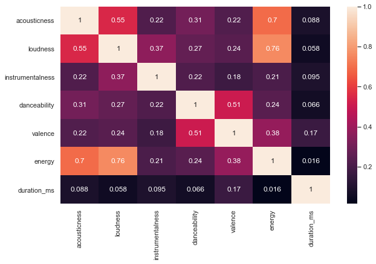

# Hit Predictor - Finding an Underlying Hit Formula within Songs 
#### by Sebastian Engels

"Look
If you had
One shot 
Or one opportunity 
To seize everything you ever wanted 
In one moment 
Would you capture it 
Or just let it slip?" 
- Eminem _Lose Yourself_

---

# 0. Introduction

    In recent years, a new field has (re-)emerged that attempts to detect audio features to predict whether a song will achieve commercialis called Hit Song Science (HSS) . It is develop

    - Power of repetition, familiarity

# 1. The Problem

    Solving the problem of Hit Song Prediction is not only an interesting scientific challenge that could help us understand the inner workings of popularity. It could also lead to very tangible business benefits.

    **Record Label Industry**:
    In many ways the risks and rewards structure of the traditional book publishing industry applies for the music industry as well (source). In general terms, a record label signs on a new artist based on the experience of the A&R department, some circumstential evidence and increasingly evidence from prior success through self-publishing and self-promotion (source). The upfront investments in these artists is often substantial and generally ranges from a few hundred thousand USD to multiple million USD. These investments often include a debut album or increasingly often mini-albums, which requires song selection. Choosing the right song for a publishing item can be crucial to the future success of an artist, especially in the early parts of their career (source). A tool for reliably predicting the chance of success for a song to become commercially successful based on its intrinsic characteristics has many potential benefits:
    
    - Support in the Song selection process
    - Allows for more calculated risks and diversified portfolios
    - Generates feedback for the A&R department when signing on a new artist
    - Feedback for Songwriters in their daily work

    **Radio Stations**
    Programming of radio stations is increasingly important, especially with the rise of streaming services taking up increasingly market share for music exploration and individualizing the taste-making experience (source). If a radio station doesn't play a song I don't like I'll likely switch to a different station with no hesitation (source). For these linear mediums it is therefore important to consistently hit my taste profile (source). Hit song prediction can help with this issue.
    
    Programming of Radio stations or Playlists on Streaming services is often history-focused, whether that is by choosing only songs from the Top 40 or artists that have already gained popularity in the past and sticking to their portfolio (source). A Hit Song predictor would allow radio stations to reduce the quantity of songs that fall into the realm of possibilities without having to stick to established artists or other suboptimal guidelines. This would allow for more time in creating valuable programming.

    Several additional use cases in the streaming market, for brick-and-mortar stores etc. are possible that I won't go into detail with.
    
# 2. The Client

    The music industry's funding model works similarly to that of publishers in other industries. There are high investments

# 3. The Data

    The data used in this project was acquired from two sources: Billboard.com and the Spotify API

    The Billboard Hot 100 go back to 1958 and were the main source to identify 'popular' tracks. The data was acquired from the site running a script that requested and parsed the weekly lists. The first time the Hot 100 were released was on August 4th, 1958 and the last date included in this analysis is April 8th, 2019. The data includes Title, Artist, Position/Rank on the Hot 100 and Date of the Positioning on the Hot 100.

    The Spotify API was used for two purposes to enrich the Hot 100 data with more meaningful information using the [Audio Features endpoint](https://developer.spotify.com/documentation/web-api/reference/tracks/get-several-audio-features/) and to create a balanced data set of songs that were released at the time of the Hot 100 songs but DIDN'T make it onto the chart. 

    The following files were used in the project:

    1. hot100.csv - Containing the Hot 100 data since 1958 enriched with performance metrics by title. This file includes 3167 weeks worth of Hot 100 songs.
    2. hits_uniq.csv - Containing the Hot 100 data that could be matched with Audio Features from the Spotify API. This file includes a total of 21002 songs.
    3. nhits_uniq.csv - Containing the Non-Hits data sampled from the Spotify API using the by year distribution of the Hot 100 data as a baseline number of songs. 

### 3.1 Data Collection

    The data from the Billboard Hot 100 was a straight-forward task. I wrote a custom scraper requested the raw html (at 10 second intervals) and parsed it using Beautiful Soup.

    Using the distribution of unique songs by year, I generated a second data set of songs that would mirror the Hits listed in the Hot 100 with Non-Hits that were released around the same time. The data was generated using the Search endpoint and randomly sampling chunks of the first 10000 results (50 songs at a time) and ~20% of the data was sampled from the bottom 10% of search results (least popular songs).

    The more challenging task was matching artist names and titles to appropriate songs in the Spotify Database. Due to the limited amount of information provided by the Hot 100 charts the Spotify API would be able to match one Hot 100 song with multiple instances in their database. For the songs I was able to match I created a list of audio features using the relevant Spotify Endpoint.

### 3.2 Data Wrangling

    **Overview**
    This section describes the various data cleaning and data wrangling methods applied to the Hot 100 and Non-Hits data. 

    **Summary Files**
    The results of Hot 100 scraper and Audio Feature endpoint resulted in separate files, as that allowed for partial processing, abrupt shutdowns and intermediate saving. For analysis purposes and faster processing these files were merged into comprehensive dataframes or actual summary files (e.g. 'data/interim/hot100_songs.csv'). 

    **Performance Features for Exploratory Data Analysis**
    The Hot 100 data was very slender, to make the later EDA phase easier, I added a few additional performance metrics to the data:

    - reentry - Total number of reentries (NaN was used for titles that have no reentries)
    - streak - Consecutive weeks a song ranked
    - ranked - Total Number of Times a song ranked
    - entry - Position it first appeared
    - exit - Position it last appeared
    - peak - Highest Position
    - low - Lowest Position

    **Duplicates and Missing Values**
    For the analysis of hits vs. non-hits, it was necessary to remove duplicates from the Hot 100 data using the `artist` and `title` columns. For each duplicate the first occurrence on the Hot 100 charts was kept, in the previous step entry and exit date columns were added to keep most of the relevant data without causing processing issues due to large files.

    The hits dataset also had a lot of missing values due to the inability of correctly matching a song with a Spotify ID or it not being available in the Spotify Database. The loss ranged from below 40% to above 15%, this is a significant loss of data. However, for our purposes it was absolutely necessary to access rich audio features as I'm attempting a content-based analysis. The missing values couldn't be easily replaced due to copyright restrictions and extensive time commitment that was outside the scope of this project. The observations that couldn't be matched with Spotify Ids had to be dropped entirely.

    In this case the Spotify features had no obvious null values as a 0 also had a interpretative power. 

    **Inconsistent Naming in Title and Artists**
    As mentioned above String matching was the major challenge in this project's wrangling stage. Artists are often collaborating for songs but the naming conventions vary from artist to artist and platform to platform. Therefore I've created unified conventions "&" or "FEATURING" was generalized to "AND", titles and artists were transformed to upper case letters, ",-'" were all generalized to single spaces, lastly accents and other special characters were either simplified or removed. 

    Subsequently the majority of records was classified a match or a non-match using a 2-gram distance ([similarity library](https://github.com/luozhouyang/python-string-similarity)). The remaining entries were manually verified. 

    **Merge**
    In the final step the audio features were merged respectively with the Hot 100 data and the Non-Hits data and a few visualizations were created to ensure the wrangling had not unexpectedly affected our data.

    See:
        [Wranling Notebook](https://github.com/Germoe/hit-predictor/blob/master/notebooks/_Step%201%20Wrangling%20(Hot%20100%20and%20Spotify%20Sample).ipynb)

# 4. The Exploratory Data Analysis (EDA)

# 5. The Inferential Statistical Analysis

    The section on inferential statistics is looking at statistical significance on observations made and thoughts had during the EDA. This is an essential step to understanding whether or not the differences between hits and non-hits are factual or just happened by chance.

    The focus for us lies on three categories:
    - Distribution between Hits and Non-Hits
    - Correlation with the Target Variable (i.e. hit or non-hit)
    - Collinearity between features

### 5.1 Challenges

    **Normality**

    One of the biggest challenges for this project was the lack of available normally distributed data. Normally distributed data is often a requirement for classical statistic tests. Luckily, the Central Limit Theorem is helping us to use the Z-Test to compare distribution differences anyways.

    **Statistical and Practical Significance**

    Due to the large sample sizes even the slightest differences can be considered statistically significant but might not actually allow us to use a feature for our model as their predictive qualities are limited. As in many other cases we need to rely on a combination of staistical test and also sound reasoning for model building.

    **Preprocessed Features**

    As we're relying on features that are preprocessed and aggregated by Spotify we're looking at features that are obtuse and abstract features. While this allows for intuitive interpretations, we're losing some of the interpretability as Spotify doesn't allow us to fully understand how these features come together.

### 5.2 Features Tested

    From what I can tell we have two different categories of features:
    - Continuous Features (e.g danceability, instrumentalness etc.)
    - Discrete Features (e.g. time signature, key etc.)

    **Continuous Features**

    In many ways hit prediction is about finding the subtle differences and similarities between hits and non-hits, continuous features tend to be much more valuable in uncovering those differences and trends across time which is why the first part of the inferential statistics tests were focused on those features. 

    **Distributions**

    To understand whether the differences between hits and non-hits observed are significant, I've conducted Z-tests for distributions on the following features (only continuous variables included):
    - acousticness
    - loudness
    - instrumentalness
    - danceability
    - valence
    - energy
    - tempo
    - duration_ms

    The method was to compare mean differences across 10000 permutations and then check whether the mean difference of the observed distributions would fall into the realm of significant possibilities. For all features above, the probability (p-value) was \<0.001, allowing me to reject the null hypothesis (H0) that hit and non-hits were equally distributed. 

    **Correlation**

    Different from exploring correlation between continous variables the process of determining feature importance with categorical variables via continuous variables is much trickier. For this project we've used logistic regression (using Pearson's r would've yielded dubious results at best - try drawing a linear regression line through a binary outcome and you'll understand why pearson's r won't be a suitable tool)

    

    Using Logistic Regression Beta based on standardized values allowed us to evaluate the relative importance of the features used. We can see at the top are three features to detect hits:
    - Instrumentalness
    - Acousticness
    - Loudness

    At the bottom we can see two features:
    - Tempo
    - Key

    Interestingly, a continuous feature such as tempo seems to have very little influence on whether the model can become a hit or not. It might be interesting to see, if Tempo would perform better if the model was taking time/year into account. The Key feature expectedly scores low in weight, no surprise there.

    We can also see that 
    - Mode 
    - Time Signature 

    are performing better than expected. However, as we've evaluated in the EDA Mode and Time Signature features aren't convincing features, these could quickly change and might overfit our model rather than leading to actual higher accuracy.

    Hence, we'll drop Tempo, Mode, Key and Time Signature.

    **Collinearity**

    For collinearity measurements we've used the popular Pearson correlation coefficient (i.e. Pearson's r). Even though this couldn't be used for describing relationships between continuous predictor and discrete target variable, it's a good metric to detect collinearity between predictors. A characteristic of multiple features standing relation to each other is an issue because our assumption is that each feature is an _independent_ variable, correlation, however implies that with a change in one variable it affects another making the relationship with the target variable increasingly murky. This has drastic implications for the stability of our model which can be read about in further detail [_here_](https://statisticsbyjim.com/regression/multicollinearity-in-regression-analysis/). 

    

    I've found strong correlation (~0.8) between `energy` and `acousticness` and `energy` and `loudness`. Somewhat present correlations (~0.6) were also visible between `acousticness` and `loudness` as well as `valence` and `danceability`. All four correlations were statistically significant for p<0.001 but as the correlations were only moderately strong for some features and removing them might've removed some actual information about a song's content, I decided to use dimension reduction through PCA instead.

    **Conclusion**

    In conclusion, we'll be using a combination of the features below to describe a song's content. To take care of collinearity issues we're using dimensionality reduction (in our case using PCA).

    - Acousticness
    - Loudness
    - Instrumentalness
    - Danceability
    - Valence
    - Energy
    - Duration_ms

    In the Machine Learning section we'll be looking at multiple different ML algorithms, Cross Validation and Performance metrics to optimize the predictive qualities of our model.

# 6. The Model
    - Dimmensionality Reduction (PCA)
    - Algorithms (Knn, RF)
    - Performance Metrics (PR, ROC)    
        - Cross Validation/ Hyper Parameter Optimization
        - Precision Recall / ROC AUC

# 7. Conclusion