# Hit Predictor - Finding an Underlying Hit Formula within Songs 
### by Sebastian Engels

"Look
If you had
One shot 
Or one opportunity 
To seize everything you ever wanted 
In one moment 
Would you capture it 
Or just let it slip?" 
- Eminem _Lose Yourself_

# 0. Introduction

In recent years, a new field has (re-)emerged that attempts to detect audio features to predict whether a song will achieve commercialis called Hit Song Science (HSS) . It is develop

- Power of repetition, familiarity

# 1. The Problem

# 2. The Client

Solving the problem of Hit Song Prediction is not only an interesting scientific challenge that could help us understand the inner workings of popularity. It could also lead to very tangible business benefits.

**Record Label Industry**:
In many ways the risks and rewards structure of the traditional book publishing industry applies for the music industry as well (source). In general terms, a record label signs on a new artist based on the experience of the A&R department, some circumstential evidence and increasingly evidence from prior success through self-publishing and self-promotion (source). The upfront investments in these artists is often substantial and generally ranges from a few hundred thousand USD to multiple million USD. These investments often include a debut album or increasingly often mini-albums, which requires song selection. Choosing the right song for a publishing item can be crucial to the future success of an artist, especially in the early parts of their career (source). A tool for reliably predicting the chance of success for a song to become commercially successful based on its intrinsic characteristics has many potential benefits:

- Support in the Song selection process
- Allows for more calculated risks and diversified portfolios
- Generates feedback for the A&R department when signing on a new artist
- Feedback for Songwriters in their daily work

**Radio Stations**
Programming of radio stations is increasingly important, especially with the rise of streaming services taking up increasingly market share for music exploration and individualizing the taste-making experience (source). If a radio station doesn't play a song I don't like I'll likely switch to a different station with no hesitation (source). For these linear mediums it is therefore important to consistently hit my taste profile (source). Hit song prediction can help with this issue.

Programming of Radio stations or Playlists on Streaming services is often history-focused, whether that is by choosing only songs from the Top 40 or artists that have already gained popularity in the past and sticking to their portfolio (source). A Hit Song predictor would allow radio stations to reduce the quantity of songs that fall into the realm of possibilities without having to stick to established artists or other suboptimal guidelines. This would allow for more time in creating valuable programming.

Several additional use cases in the streaming market, for brick-and-mortar stores etc. are possible that I won't go into detail with.

# 3. The Data

The data used in this project was acquired from two sources: Billboard.com and the Spotify API

The Billboard Hot 100 go back to 1958 and were the main source to identify 'popular' tracks. The data was acquired from the site running a script that requested and parsed the weekly lists. The first time the Hot 100 were released was on August 4th, 1958 and the last date included in this analysis is April 8th, 2019. The data includes Title, Artist, Position/Rank on the Hot 100 and Date of the Positioning on the Hot 100.

The Spotify API was used for two purposes to enrich the Hot 100 data with more meaningful information using the [Audio Features endpoint](https://developer.spotify.com/documentation/web-api/reference/tracks/get-several-audio-features/) and to create a balanced data set of songs that were released at the time of the Hot 100 songs but DIDN'T make it onto the chart. 

The following files were used in the project:

1. hot100.csv - Containing the Hot 100 data since 1958 enriched with performance metrics by title. This file includes 3167 weeks worth of Hot 100 songs.
2. hits_uniq.csv - Containing the Hot 100 data that could be matched with Audio Features from the Spotify API. This file includes a total of 21002 songs.
3. nhits_uniq.csv - Containing the Non-Hits data sampled from the Spotify API using the by year distribution of the Hot 100 data as a baseline number of songs. 

## 3.1 Data Collection

The data from the Billboard Hot 100 was a straight-forward task. I wrote a custom scraper requested the raw html (at 10 second intervals) and parsed it using Beautiful Soup.

Using the distribution of unique songs by year, I generated a second data set of songs that would mirror the Hits listed in the Hot 100 with Non-Hits that were released around the same time. The data was generated using the Search endpoint and randomly sampling chunks of the first 10000 results (50 songs at a time) and ~20% of the data was sampled from the bottom 10% of search results (least popular songs).

The more challenging task was matching artist names and titles to appropriate songs in the Spotify Database. Due to the limited amount of information provided by the Hot 100 charts the Spotify API would be able to match one Hot 100 song with multiple instances in their database. For the songs I was able to match I created a list of audio features using the relevant Spotify Endpoint.

## 3.2 Data Wrangling

**Overview**
This section describes the various data cleaning and data wrangling methods applied to the Hot 100 and Non-Hits data. 

**Summary Files**
The results of Hot 100 scraper and Audio Feature endpoint resulted in separate files, as that allowed for partial processing, abrupt shutdowns and intermediate saving. For analysis purposes and faster processing these files were merged into comprehensive dataframes or actual summary files (e.g. 'data/interim/hot100_songs.csv'). 

**Performance Features for Exploratory Data Analysis**
The Hot 100 data was very slender, to make the later EDA phase easier, I added a few additional performance metrics to the data:

- reentry - Total number of reentries (NaN was used for titles that have no reentries)
- streak - Consecutive weeks a song ranked
- ranked - Total Number of Times a song ranked
- entry - Position it first appeared
- exit - Position it last appeared
- peak - Highest Position
- low - Lowest Position

**Duplicates and Missing Values**
For the analysis of hits vs. non-hits, it was necessary to remove duplicates from the Hot 100 data using the `artist` and `title` columns. For each duplicate the first occurrence on the Hot 100 charts was kept, in the previous step entry and exit date columns were added to keep most of the relevant data without causing processing issues due to large files.

The hits dataset also had a lot of missing values due to the inability of correctly matching a song with a Spotify ID or it not being available in the Spotify Database. The loss ranged from below 40% to above 15%, this is a significant loss of data. However, for our purposes it was absolutely necessary to access rich audio features as I'm attempting a content-based analysis. The missing values couldn't be easily replaced due to copyright restrictions and extensive time commitment that was outside the scope of this project. The observations that couldn't be matched with Spotify Ids had to be dropped entirely.

In this case the Spotify features had no obvious null values as a 0 also had a interpretative power. 

**Inconsistent Naming in Title and Artists**
As mentioned above String matching was the major challenge in this project's wrangling stage. Artists are often collaborating for songs but the naming conventions vary from artist to artist and platform to platform. Therefore I've created unified conventions "&" or "FEATURING" was generalized to "AND", titles and artists were transformed to upper case letters, ",-'" were all generalized to single spaces, lastly accents and other special characters were either simplified or removed. 

Subsequently the majority of records was classified a match or a non-match using a 2-gram distance ([similarity library](https://github.com/luozhouyang/python-string-similarity)). The remaining entries were manually verified. 

**Merge**
In the final step the audio features were merged respectively with the Hot 100 data and the Non-Hits data and a few visualizations were created to ensure the wrangling had not unexpectedly affected our data.

See:
    [Wranling Notebook](https://github.com/Germoe/hit-predictor/blob/master/notebooks/_Step%201%20Wrangling%20(Hot%20100%20and%20Spotify%20Sample).ipynb)

# 4. The Exploratory Data Analysis (EDA)

Exploring our available data will be split into two stages. First, we'll have a close look at the historic data of the Hot 100 to better understand the underlying quirks in how it comes together, identifying possible issues or opportunities for model-building and general curiosity of the history of the Hot 100. Second, we're looking at the audio-features from Hits (a subset of the Hot 100) and a sample of Non-Hits (see _Data_ for more information).

## 4.1 History of Hot 100

Started by Billboard Magazine the Billboard Hot 100 is the industry standard record chart in the United States. It is published on a weekly basis.

Chart rankings are based on sales (physical and digital), radio play, and online streaming in the United States. If we define success of a song as commercial success, the charts are a way to understand the mainstream popularity/market value of a song and are often used as such in scientific studies (source).

It should also be noted that the Billboard Hot 100 is not the most accurate tool for identifying all commercially successful songs as their rules and tracking tools are subject to flaws. A common example of this is their policy to not include songs that weren't released as singles (revoked in 1998). This led to some of the most commercially successful songs never making it onto the Hot 100. Nevertheless, it's the best tool we have readily available. Another drawback is simply the arbitrary cut-off at 100 songs a week, artificially limiting the amount of possible Hits at any given point.

We'll start by looking into the frequency of songs in the Hot 100 through the years.

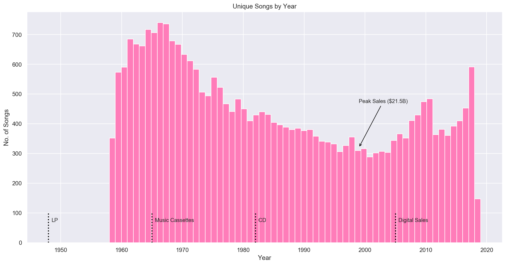

    Since 1958 there were *28083* songs on the Billboard Hot 100.

It looks like starting in the late 1960s songs stayed on the Billboard Hot 100 for increasingly long periods (streak length increased) and we had less fluctuation (i.e. new songs entering and old songs dropping off). However, in more recent years, starting in 2005, this fluctuation seems to be picking back up again. 

The graph is annotated with significant changes in the music medium and sales revenue (RIAA) to provide context. The recent increase of unique songs starts in the mid 2000s and follows the integration of digital sales into the Hot 100 formula. A possible explanation for an increase here could be that with digital sales it was possible for the first time to only buy a single song instead of having to buy the official single. This was possible for around 99 cents instead of the usual pricing for a single between 5-15 USD, resulting in a lowering of the financial hurdle to increase the sales numbers of a single song.

One of the lowest fluctuation points also coincides with the high point of sales in the music industry, also commonly known as the year in which Napster disrupted the music industry.

### 4.1.1 Streaks

There are many ways to look at this data to gain further insights. Looking at the duration a song stays on the Hot 100 allows us to gauge fluctuation and gain an understanding of underlying structure of entering, exiting and general movement through the Hot 100 during its stay.

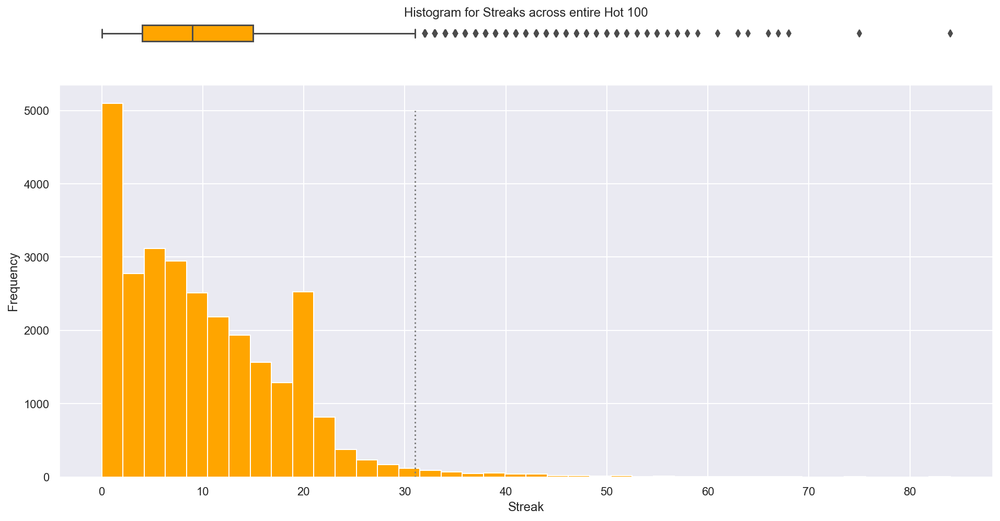

    Outliers in Streaks across the entire data set (Tukey's Fence k=1.5): >31

We can see a contrinuous fall as we're getting toward the higher streak lengths. One interesting peak can be observed at streak length 20. For some reason this bin is defying the downward trend.

We'll have a closer look at this distribution by year in the next plot.

**19-week Pattern of lower 75% (third quartile)**

Between 1991 and 2016 the third quartile (i.e. upper quartile) is consistently at 19 streak weeks (i.e. 20 weeks on the Hot 100 due to the 0-indexing of the streak metric). There's no deviation from this pattern, no single year has a third quartile that surpasses this threshold. 

Looking into the underlying formula it looks like it has to do with a Hot 100 rule introduced in 1991 with the intend to speed up fluctuation ([20-20 rule](https://web.stanford.edu/~xhnguyen/BillboardandTechnology.pdf)). This rule specifies that a song that has fallen out of the top 20 will be removed after 20 weeks. The rule was relaxed in 1992 and 1993 to falling out of the top 40 and top 50 respectively.

The following plot highlights this effect distinctively by looking at exit positions of song before 1991 and after 1991.

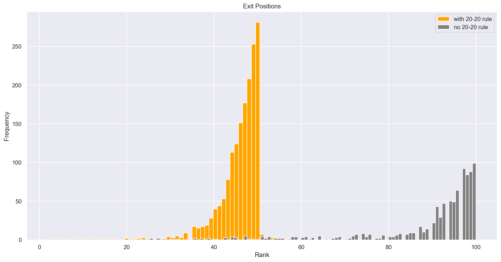 

    Number of songs whose streak was likely cut short: 1693

Above we can see the exit positions of songs with >19 weeks streaks before and after the 20-20 rule. It can be assumed that this rule has cut the streak of songs after 1991 short as we can see that generally songs would exit at the bottom of the Hot 100 (see no 20-20 rule) rather than dropping off suddenly.

#### Higher Fluctuation in Recent Years

Going back to the `Streaks by Year` plot. Starting in 2006 we can see that the first quartile (i.e. lower quartile) is stretching into the <3 weeks region. A pattern we hadn't seen since the mid-1970s. This would indicate a higher fluctuation and is probably a result of Billboard slowly incorporating more and more online sales and streaming revenue into their formula since 2005 (https://en.m.wikipedia.org/wiki/Billboard_Hot_100 see _Digital downloads and online streaming_). 

**Super Songs**

Until the early 1970s no song title would be on the Hot 100 for more than 25 weeks and until the early 1990s staying charted for over 31 weeks (i.e. outliers across the entire data as shown in _Histogram of Streaks_ above) was the rare exception. In fact, there are only 6 artists who've achieved this feat (they are listed below).

There is a clear pattern distinction between the charts after 1991 and previous periods. 1991 happens to be the year that the Hot 100 started to use Nielsen Soundscan, which gathered more precise music sales data (previously sales numbers were self-reported by stores). [Hot 100 Formula changes](https://en.wikipedia.org/wiki/Billboard_Hot_100) and [discussion](https://ndsmcobserver.com/2018/01/billboard-hot-100-controversy/)

    Number of Titles that stayed on the Hot 100 for more than 31 weeks 
    Before 1991 (33 years) - 6
    After 1991 (29 years) - 430

#### Before 1991

<table border="1" class="dataframe">
  <thead>
    <tr style="text-align: right;">
      <th></th>
      <th></th>
      <th>streak</th>
      <th>peak</th>
      <th>entry</th>
      <th>exit</th>
    </tr>
    <tr>
      <th>artist</th>
      <th>title</th>
      <th></th>
      <th></th>
      <th></th>
      <th></th>
    </tr>
  </thead>
  <tbody>
    <tr>
      <th>Soft Cell</th>
      <th>Tainted Love</th>
      <td>42</td>
      <td>8</td>
      <td>90</td>
      <td>97</td>
    </tr>
    <tr>
      <th>Paul Davis</th>
      <th>I Go Crazy</th>
      <td>39</td>
      <td>7</td>
      <td>89</td>
      <td>99</td>
    </tr>
    <tr>
      <th>Young M.C.</th>
      <th>Bust A Move</th>
      <td>38</td>
      <td>7</td>
      <td>81</td>
      <td>90</td>
    </tr>
    <tr>
      <th>Kris Kristofferson</th>
      <th>Why Me</th>
      <td>37</td>
      <td>16</td>
      <td>100</td>
      <td>52</td>
    </tr>
    <tr>
      <th>Laura Branigan</th>
      <th>Gloria</th>
      <td>35</td>
      <td>2</td>
      <td>84</td>
      <td>98</td>
    </tr>
    <tr>
      <th>Bee Gees</th>
      <th>How Deep Is Your Love</th>
      <td>32</td>
      <td>1</td>
      <td>83</td>
      <td>59</td>
    </tr>
  </tbody>
</table>

Go to Playlist: https://open.spotify.com/user/1162788143/playlist/0iP1Sz5qSCmVomZUNYbKPj?si=8SyDMByGRK60HNPHv9-HZA

---

#### After 1991 (Top 10 shown)

<table border="1" class="dataframe">
  <thead>
    <tr style="text-align: right;">
      <th></th>
      <th></th>
      <th>streak</th>
      <th>peak</th>
      <th>entry</th>
      <th>exit</th>
    </tr>
    <tr>
      <th>artist</th>
      <th>title</th>
      <th></th>
      <th></th>
      <th></th>
      <th></th>
    </tr>
  </thead>
  <tbody>
    <tr>
      <th>Imagine Dragons</th>
      <th>Radioactive</th>
      <td>84</td>
      <td>3</td>
      <td>93</td>
      <td>49</td>
    </tr>
    <tr>
      <th>Jason Mraz</th>
      <th>I'm Yours</th>
      <td>75</td>
      <td>6</td>
      <td>93</td>
      <td>48</td>
    </tr>
    <tr>
      <th>LeAnn Rimes</th>
      <th>How Do I Live</th>
      <td>68</td>
      <td>2</td>
      <td>89</td>
      <td>45</td>
    </tr>
    <tr>
      <th>OneRepublic</th>
      <th>Counting Stars</th>
      <td>67</td>
      <td>2</td>
      <td>32</td>
      <td>50</td>
    </tr>
    <tr>
      <th>LMFAO Featuring Lauren Bennett &amp; GoonRock</th>
      <th>Party Rock Anthem</th>
      <td>66</td>
      <td>1</td>
      <td>78</td>
      <td>49</td>
    </tr>
    <tr>
      <th>Jewel</th>
      <th>Foolish Games/You Were Meant For Me</th>
      <td>64</td>
      <td>2</td>
      <td>61</td>
      <td>47</td>
    </tr>
    <tr>
      <th>Adele</th>
      <th>Rolling In The Deep</th>
      <td>63</td>
      <td>1</td>
      <td>68</td>
      <td>49</td>
    </tr>
    <tr>
      <th>Carrie Underwood</th>
      <th>Before He Cheats</th>
      <td>63</td>
      <td>8</td>
      <td>92</td>
      <td>47</td>
    </tr>
    <tr>
      <th>The Lumineers</th>
      <th>Ho Hey</th>
      <td>61</td>
      <td>3</td>
      <td>90</td>
      <td>50</td>
    </tr>
    <tr>
      <th>Lady Antebellum</th>
      <th>Need You Now</th>
      <td>59</td>
      <td>2</td>
      <td>85</td>
      <td>48</td>
    </tr>
  </tbody>
</table>

Go to Playlist: https://open.spotify.com/user/1162788143/playlist/4hzjzSssha8VLHqwbyJiWA?si=xWT5wbXAR7OOeuyCrQKO-w

_NOTE: Unfortunately, there is 52 of the 430 songs missing from the playlist that couldn't be found on Spotify or are missing due to country restrictions._

50% of songs stayed on the Hot 100 for less than 10 weeks. The longest streak is 84 weeks and is held by 'Imagine Dragons' with 'Radioactive', a not so close runner-up is 'Jason Mraz' with 'I'm Yours' (75 weeks). 

Again we can see the effect of the 20-20 rule in the second song set's `exit` column - most songs exited on a position slightly before or at 50. While the the table before 1991 shows all songs (with the exception of one) exited closer to 100 than to 50.

Let's look at outliers for the streak variable (>31 weeks) by year to have a better look at their distribution.

Starting in 1995 we can see a pattern of what I'm going to call 'Super Songs' emerge. Before 1995, there were only few songs that stayed long enough to be considered an outlier (Tukey's Fence rule). After 1993, however we can suddenly see these breakout songs occuring much more often. Standout years are 1996, 2001 and 2018 but other years are generating outliers more densely as well.

    Standard Deviations:
    <1991: 5.703656742368894
    >=1991: 10.154355499124337

This is despite (or due to?) a generally larger standard deviation in streaks on the Hot 100 after 1991. We can also see in the first streak plot that the outliers tend to stray further than outliers before 1991 (i.e. they stay longer on the Hot 100 or are 'stickier').

#### Is there a significant difference between the distribution of the Hot 100 before and after the introduction of Nielsen Soundscan data in 1991?

Throughout the above analysis, we've seen the year 1991 reappear over and over again as a cut-off point. It is time to understand whether and how Nielsen Soundscan might've affected the Hot 100. 

Let's first have a look at the distributions before and after 1991.

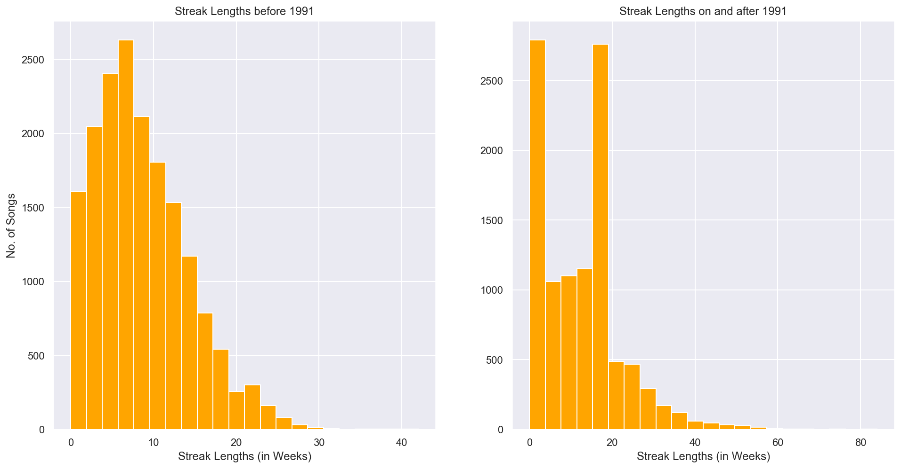

If the only change affecting the data was the 20-20 rule and the Nielsen Soundscan and other unknown factors had no effect on the streak length, we would expect roughly the same distribution for songs of 20 or less weeks on the Hot 100. However, we can see that the distribution of Hot 100 songs before and after 1991 are very different. The streaks length for songs after 1991 is far more left skewed than before. Most songs are in the lowest bin, only rivaled by the 19 streak weeks bin, which we've seen by the [`Exit Positions`](#exit-positions) plot was likely introduced by the 20-20 rule.

#### Test & Hypothesis

To see whether the change in distribution is statistically significant we're going to compare the mean of the distributions with a one-sided test. The assumption being that if the distributions of the population are equal beyond the 20-20 rule the mean of the distributions after 1991 should be lower than before 1991 as the 20-20 rule would prevent relatively more songs from going beyond 20 weeks on the Hot 100.

- **H0**: The mean streak length after 1991 is equal or lower than the mean streak length before 1991 (i.e. mean fluctuation stayed the same or increased). This would indicate that there is no indication the underlying distribution has changed.
- **H1**: The mean streak length after 1991 is larger than the mean streak length before 1991 (i.e. mean fluctuation decreased). This would indicate that there is an indication the underlying distribution has changed. This would indicate that the only other known change in that period, the introduction of Nielsen Data, could've led to an increase in streak lengths.
- **alpha**: 0.05

    p: 0.0

It is highly unlikely that the distributions are the same.  We can reject H0 for alpha > 0.001. Hence, there is an argument to be made that the introduction of Nielsen Data has had an effect on the distribution of the Hot 100. 

An argument could be made that without the introduction of the 20-20 rule along with the Nielsen Soundscan the Hot 100 could've become much staler than it has anyways. The 20-20 rule might've been introduced to offset the negative effect on fluctuation that was introduced by more accurate sales data.

#### Conclusion

The Hot 100 have gotten more stale through the years. We've seen less fluctuation of new unique songs being introduced to the Hot 100. More detailed sales data in the early 90s (Nielsen Soundscan) might've amplified that trend and was only held back by artificial streak length hurdles (20-20 rule). 

Since the 1970s unique songs per year had continually decreased, the change in that trend didn't come until the introduction of digital sales in the formula in 2005 and streaming data (i.e. Spotify, Youtube etc.). While it hasn't returned to its former diversity we've seen a small upwards trend in unique songs per year in recent years.

It was also argued that Nielsen Soundscan, with its addition of more granular data on song's actual sales data allowed the emergence of 'Super Songs', i.e. regular appearance of songs that stay on the Hot 100 for more than 31 weeks.

### 4.1.2 The relationship of Peak Position and Streak Length

A common assumption I've always had was songs that have a higher peak position tend to stay on the Hot 100 longer. Let's investigate that assumption below.

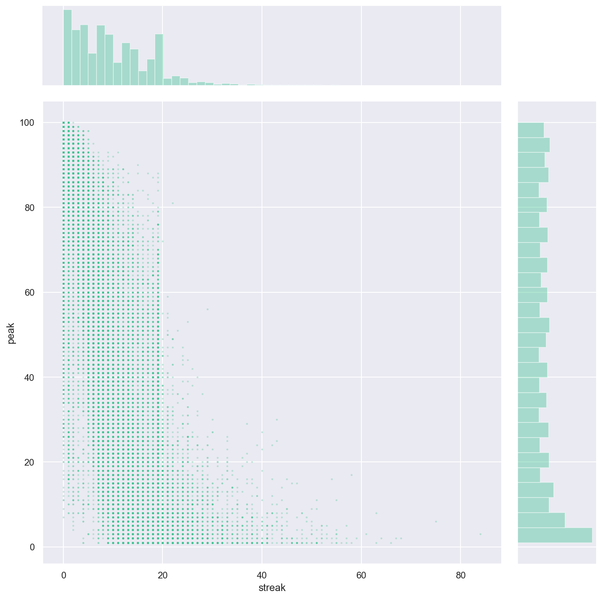

    Spearman's R: -0.7857196745443265 p-value: 0.0

We can see a roughly linear monotonic relationship (tested using Spearman's R) with a p value of 0. This means that there certainly is a relationship between streak lengths and peak position. The higher the peak position is the longer a song tends to stay on the Hot 100. We can see that this seems to be especially true for songs that make it onto the top 20. 

We had to use Spearman's R in this case as Pearson's R requires a normality assumption, which due to the inherent 1-100 scale is rarely given.

_Quick Note: At Streak position 19 we can see an unusually bold line, this clearly demarcates the skewedness that the so-called "20-20 rule" (explained above) has introduced into the data._

#### Pole Position Streaks

Now we know that songs that have higher peak positions tend to stay on the hot 100 longer but we've also seen that the pole position (i.e. rank 1) has the highest number of unique songs (see histogram of Joint plot above) indicating that this is a highly battled over position. Staying on the Hot 100 is one thing but I'm curious what songs were able to stay on the Hot 100's most coveted position the longest.

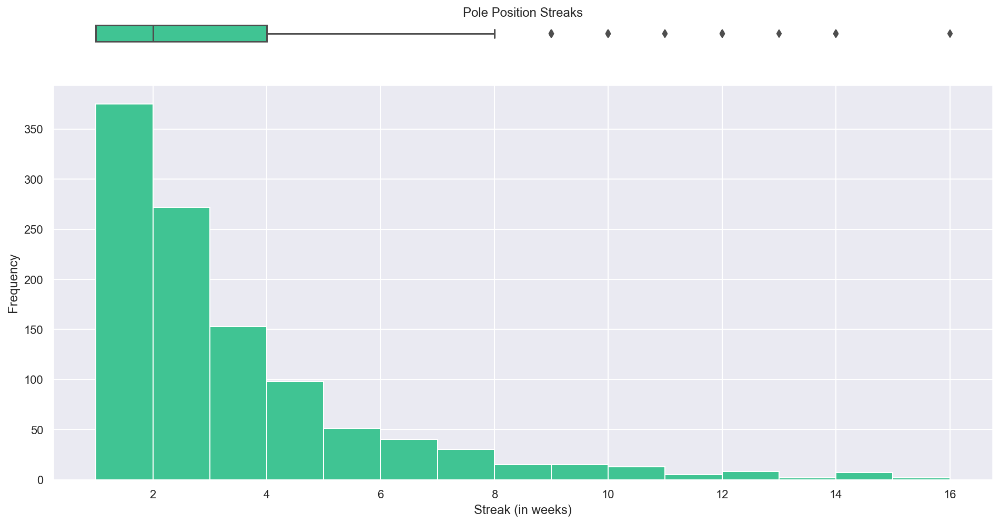

<table border="1" class="dataframe">
  <thead>
    <tr style="text-align: right;">
      <th></th>
      <th></th>
      <th>weeks</th>
    </tr>
    <tr>
      <th>artist</th>
      <th>title</th>
      <th></th>
    </tr>
  </thead>
  <tbody>
    <tr>
      <th>Luis Fonsi &amp; Daddy Yankee Featuring Justin Bieber</th>
      <th>Despacito</th>
      <td>16</td>
    </tr>
    <tr>
      <th>Mariah Carey &amp; Boyz II Men</th>
      <th>One Sweet Day</th>
      <td>16</td>
    </tr>
  </tbody>
</table>

    Total No.1 Hits: 1086

We can see 1086 songs made it to the top of the Hot 100 charts and that less than 50% of those lasted more than 2 weeks on the Hot 100 pole position. Of those only 2 songs were able to stay on the very top of the Hot 100 charts for 16 weeks (i.e. the longest streak).

### 4.1.3 Movements

Now that we've looked at peak positions and streaks, I'm interested to know how the jumps from one position (i.e. a leap) to another are distributed.

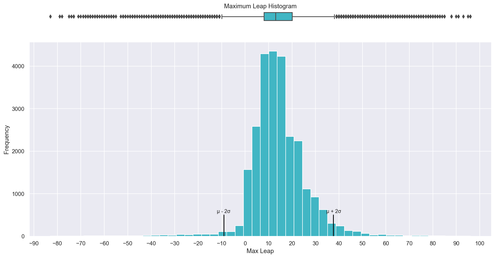

We see that the median leap was just above 10 positions and that we can generally expect for most titles to leap at most between 7-19 places. We also can see that leaps beyond 38 positions are generally rare, so are negative maximum leaps beyond -9 (i.e. titles that consistently fell in position from their initial entry).

We can also see that generally a title moves up at some point during their time on the Hot 100 due to the shift of the distribution to values above 0.

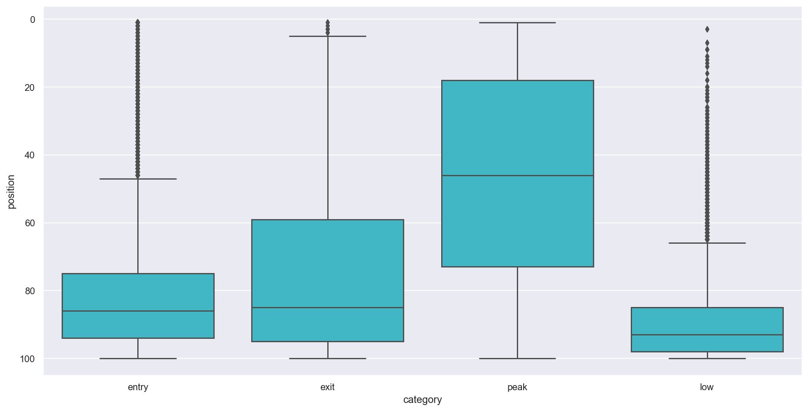

As seen at the beginning of the Exploratory Data Analysis (EDA). Generally songs enter and exit the Hot 100 in the lower positions. As expected it is hard to stay higher up on the Hot 100 and less than 50% of songs make it into the coveted Top 40.

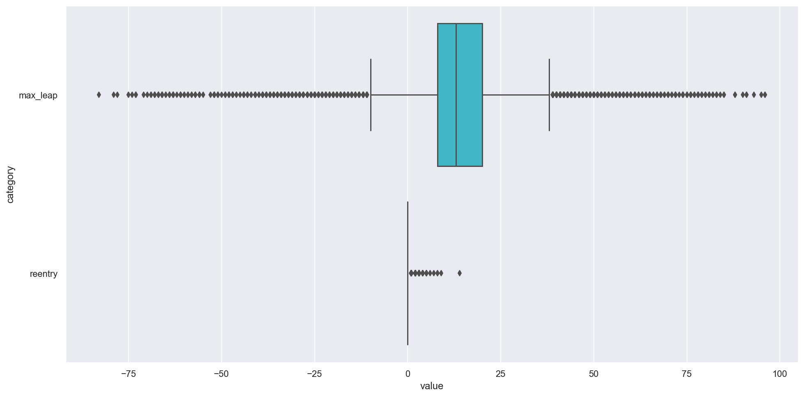

We can see that consistently falling in position is rare on the Hot 100 (i.e. only few songs have negative max_leaps). There are a total of 6 songs that were able to leap more than 90 positions from one week to another.

<table border="1" class="dataframe">
  <thead>
    <tr style="text-align: right;">
      <th></th>
      <th></th>
      <th>entry_year</th>
      <th>exit_year</th>
      <th>reentry</th>
      <th>streak</th>
      <th>ranked</th>
      <th>entry</th>
      <th>exit</th>
      <th>peak</th>
      <th>low</th>
      <th>max_leap</th>
    </tr>
    <tr>
      <th>artist</th>
      <th>title</th>
      <th></th>
      <th></th>
      <th></th>
      <th></th>
      <th></th>
      <th></th>
      <th></th>
      <th></th>
      <th></th>
      <th></th>
    </tr>
  </thead>
  <tbody>
    <tr>
      <th>Dixie Chicks</th>
      <th>Not Ready To Make Nice</th>
      <td>2006</td>
      <td>2007</td>
      <td>2</td>
      <td>16</td>
      <td>24</td>
      <td>28</td>
      <td>42</td>
      <td>4</td>
      <td>100</td>
      <td>96.0</td>
    </tr>
    <tr>
      <th>Kelly Clarkson</th>
      <th>My Life Would Suck Without You</th>
      <td>2009</td>
      <td>2009</td>
      <td>0</td>
      <td>23</td>
      <td>24</td>
      <td>97</td>
      <td>44</td>
      <td>1</td>
      <td>97</td>
      <td>96.0</td>
    </tr>
    <tr>
      <th>Britney Spears</th>
      <th>Womanizer</th>
      <td>2008</td>
      <td>2009</td>
      <td>0</td>
      <td>22</td>
      <td>23</td>
      <td>96</td>
      <td>45</td>
      <td>1</td>
      <td>96</td>
      <td>95.0</td>
    </tr>
    <tr>
      <th>Lady Gaga</th>
      <th>Million Reasons</th>
      <td>2016</td>
      <td>2017</td>
      <td>4</td>
      <td>8</td>
      <td>20</td>
      <td>76</td>
      <td>41</td>
      <td>4</td>
      <td>97</td>
      <td>93.0</td>
    </tr>
    <tr>
      <th>LL Cool J Featuring Jennifer Lopez</th>
      <th>Control Myself</th>
      <td>2006</td>
      <td>2006</td>
      <td>1</td>
      <td>7</td>
      <td>11</td>
      <td>93</td>
      <td>99</td>
      <td>4</td>
      <td>99</td>
      <td>91.0</td>
    </tr>
    <tr>
      <th>Beyonce &amp; Shakira</th>
      <th>Beautiful Liar</th>
      <td>2007</td>
      <td>2007</td>
      <td>0</td>
      <td>17</td>
      <td>18</td>
      <td>94</td>
      <td>91</td>
      <td>3</td>
      <td>94</td>
      <td>91.0</td>
    </tr>
  </tbody>
</table>

To visualize the journey of these songs we'll make an attempt at visualizing it.

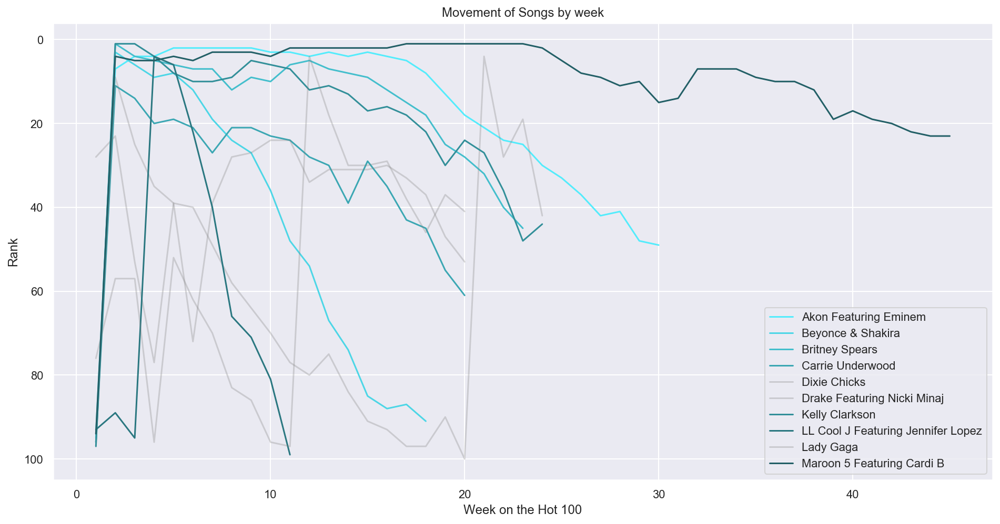

4 out of the songs rise show their max leap to their peak position within the first 4 weeks of their first appearance on the Hot 100. After the initial high is reached there tends to be more or less a steady decline in position. Let's explore this thought further by looking at the time to max leap and average distance to peak position.

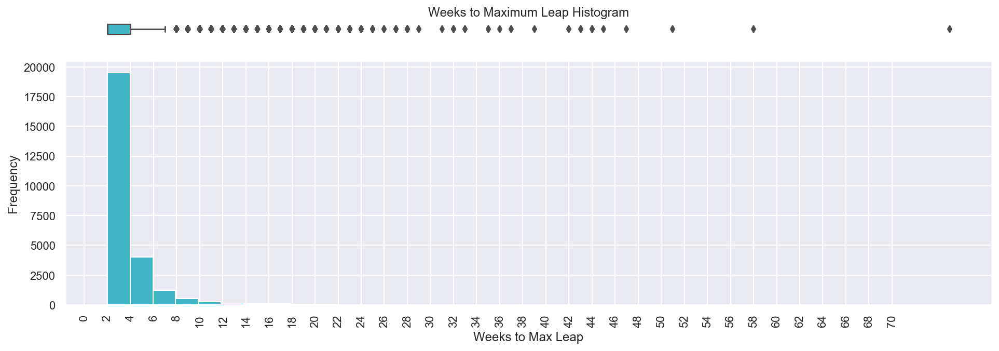

We can see that the highest jumps occur most often in the second to fourth week of songs making their debut on the Hot 100. Let's now examine whether this maximum leap is close to the final peak position.

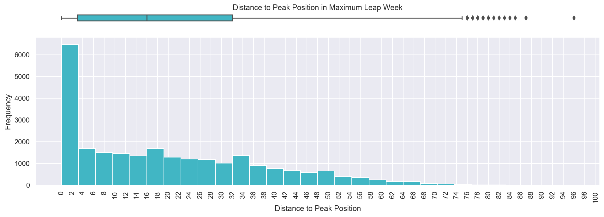

    Number of titles that reached their peak position in the week of their maximum leap: 4375 (i.e. 15.58%)
    
              dist_peak          peak
    count  25273.000000  25273.000000
    mean      19.549559     43.111898
    std       17.725495     29.457823
    min        0.000000      1.000000
    25%        3.000000     16.000000
    50%       16.000000     41.000000
    75%       32.000000     68.000000
    max       96.000000    100.000000

4375 (i.e. 15.58%) immediately reach their peak position after their largest leap. The top 25% fall within 3 positions of their peak and the top 50% fall within 16 positions.

We can see that there is quite a large standard deviation of +-17.73 ranks from the mean of 19.54 ranks. While a large chunk of songs might be reaching the peak position after their max leap.

### 4.1.4 Reentries

There's very few reentries. Most songs that leave the Hot 100 leave for good and only about 4% of the ones that do make a reappearance do so more than twice. In fact, only 6 songs have made a reappearance on the Hot 100 more than 5 times, and they are all seasonal Christmas Evergreens (with one exception 'Unchained Melody' by 'The Righteous Brothers' has made a comeback 14 times over a period of 26 years).

<table border="1" class="dataframe">
  <thead>
    <tr style="text-align: right;">
      <th></th>
      <th></th>
      <th>entry_year</th>
      <th>exit_year</th>
      <th>reentry</th>
      <th>streak</th>
      <th>ranked</th>
      <th>entry</th>
      <th>exit</th>
      <th>peak</th>
      <th>low</th>
      <th>max_leap</th>
    </tr>
    <tr>
      <th>artist</th>
      <th>title</th>
      <th></th>
      <th></th>
      <th></th>
      <th></th>
      <th></th>
      <th></th>
      <th></th>
      <th></th>
      <th></th>
      <th></th>
    </tr>
  </thead>
  <tbody>
    <tr>
      <th>The Righteous Brothers</th>
      <th>Unchained Melody</th>
      <td>1965</td>
      <td>1991</td>
      <td>14</td>
      <td>12</td>
      <td>57</td>
      <td>72</td>
      <td>89</td>
      <td>4</td>
      <td>97</td>
      <td>57.0</td>
    </tr>
    <tr>
      <th>Brenda Lee</th>
      <th>Rockin' Around The Christmas Tree</th>
      <td>1960</td>
      <td>2019</td>
      <td>9</td>
      <td>4</td>
      <td>26</td>
      <td>64</td>
      <td>9</td>
      <td>9</td>
      <td>89</td>
      <td>38.0</td>
    </tr>
    <tr>
      <th>Bobby Helms</th>
      <th>Jingle Bell Rock</th>
      <td>1958</td>
      <td>2019</td>
      <td>8</td>
      <td>4</td>
      <td>25</td>
      <td>57</td>
      <td>8</td>
      <td>8</td>
      <td>99</td>
      <td>28.0</td>
    </tr>
    <tr>
      <th>Mariah Carey</th>
      <th>All I Want For Christmas Is You</th>
      <td>2000</td>
      <td>2019</td>
      <td>8</td>
      <td>5</td>
      <td>29</td>
      <td>83</td>
      <td>3</td>
      <td>3</td>
      <td>83</td>
      <td>54.0</td>
    </tr>
    <tr>
      <th>Nat King Cole</th>
      <th>The Christmas Song (Merry Christmas To You)</th>
      <td>1960</td>
      <td>2019</td>
      <td>7</td>
      <td>4</td>
      <td>16</td>
      <td>100</td>
      <td>11</td>
      <td>11</td>
      <td>100</td>
      <td>20.0</td>
    </tr>
    <tr>
      <th>Bing Crosby</th>
      <th>White Christmas</th>
      <td>1958</td>
      <td>2019</td>
      <td>6</td>
      <td>2</td>
      <td>15</td>
      <td>86</td>
      <td>34</td>
      <td>12</td>
      <td>86</td>
      <td>33.0</td>
    </tr>
  </tbody>
</table>

### 4.1.5 Conclusion

We've learned that the 1991 introduction of Nilsen Soundscan data likely contributed to a different distribution in the Hot 100. It likely contributed to so-called 'Super Songs' that are able to stay on the Hot 100 for much longer than songs previously. We've also seen that the distribution after 1991 highly skewed the distribution toward one week songs (those that only stay on the Hot 100 for a single week) while creating a uniform distribution between 1-18 week streaks. This should be considered in terms of weighing certain songs into categories as their might be different criteria for songs before 1991 and after 1991, also we should keep an eye out for possibly introducing a different type of music after 1991 due to the more granular data.

## 4.2 Features of Hits and Non-Hits

To dive deeper into the actual make up of a song and see if we can build a model that can reliably identify songs on its content, we'll have a look at the audio features of a hit by looking at its audio signature. Let's start with a few descriptive metrics!

    There are 34671 rows and 20 columns

There are a few features that show some distinct trends when compared to non-hits. Median Danceability, Energy, Loudness and Valence of Hot 100 / hits are pretty consistently above their non-hits counterpart. While Acousticness has consistently a lower median across time. Instrumentalness and Speechiness show some interesting patterns that we should have a closer look at. Let's have a closer look at danceability first.

### 4.2.1 Danceability

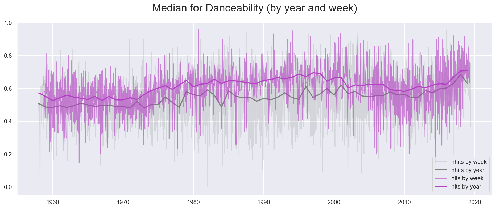

_"Danceability describes how suitable a track is for dancing based on a combination of musical elements including tempo, rhythm stability, beat strength, and overall regularity."_ [Spotify Track Features Description](https://developer.spotify.com/documentation/web-api/reference/tracks/get-audio-features/)

Simply looking at the amplitude of the two by day graphs, it's obvious that there is quite a bit of overlap between hits and non-hits in terms of danceability. Nevertheless, Hits generally seem to be more danceable. We can see an upward trend starting in the mid 1970s with non-hits staying roughly the same (if introducing more variability). From the mid 1980s and late 1990s we can additionally see the amplitude between days visibly shrinking (i.e. less variability) suggesting that less danceable songs had a hard time getting onto the Hot 100 in this period. This is not a big surprise as the 1980s and 1990s are quite literally known for the emergence of dance and dance-pop. 

While the 1980s and 1990s were the age when danceability had the highest chance of thriving in the Hot 100, it should be said that with the introduction of disco music in the 1970s has most likely played role in clearing the way for this trend (i.e. see the uptick starting in the mid 1970s).

Starting in the early 2000s we're starting to see a minor slump in danceability, which lasted until the mid 2010s. Now in the most recent years (likely pushed with the rise of Electronic Dance Music (EDM)), we're seeing the highest level of danceability in the Hot 100 hits and quite low variability in 2018 and 2019. It's also notable that non-hits have been catching up in danceability and have closed in on the median danceability of the Hot 100 (disregarding the drop in 2019).

For our model, it can be seen that especially during the mid-1970s and mid-2000s there is a visible difference in danceability and that median hits have been consistently more danceable than median non-hits (_see inference analysis below).

Lastly, let's look at a few of the most danceable songs throughout the history of the Hot 100.

<table border="1" class="dataframe">
  <thead>
    <tr style="text-align: right;">
      <th></th>
      <th></th>
      <th>date</th>
      <th>danceability</th>
      <th>hit</th>
      <th>peak</th>
    </tr>
    <tr>
      <th>artist</th>
      <th>title</th>
      <th></th>
      <th></th>
      <th></th>
      <th></th>
    </tr>
  </thead>
  <tbody>
    <tr>
      <th>Tone-Loc</th>
      <th>Funky Cold Medina</th>
      <td>1989-06-03</td>
      <td>0.988</td>
      <td>True</td>
      <td>3.0</td>
    </tr>
    <tr>
      <th>DJ Suede The Remix God</th>
      <th>Cash Me Outside (#CashMeOutside)</th>
      <td>2017-03-04</td>
      <td>0.981</td>
      <td>True</td>
      <td>72.0</td>
    </tr>
    <tr>
      <th>Glee Cast</th>
      <th>Ice Ice Baby</th>
      <td>2010-05-22</td>
      <td>0.980</td>
      <td>True</td>
      <td>74.0</td>
    </tr>
    <tr>
      <th>The Jacksons</th>
      <th>State of Shock</th>
      <td>1984-09-22</td>
      <td>0.980</td>
      <td>True</td>
      <td>3.0</td>
    </tr>
    <tr>
      <th>Vanilla Ice</th>
      <th>Ice Ice Baby</th>
      <td>1990-09-08</td>
      <td>0.978</td>
      <td>True</td>
      <td>1.0</td>
    </tr>
    <tr>
      <th>Evelyn King</th>
      <th>Betcha She Don't Love You</th>
      <td>1983-01-22</td>
      <td>0.974</td>
      <td>True</td>
      <td>49.0</td>
    </tr>
    <tr>
      <th>Jermaine Jackson</th>
      <th>Let Me Tickle Your Fancy</th>
      <td>1982-10-30</td>
      <td>0.973</td>
      <td>True</td>
      <td>18.0</td>
    </tr>
    <tr>
      <th>2nd II None</th>
      <th>Be True To Yourself</th>
      <td>1992-01-11</td>
      <td>0.971</td>
      <td>True</td>
      <td>78.0</td>
    </tr>
    <tr>
      <th>Cardi B Featuring Migos</th>
      <th>Drip</th>
      <td>2018-06-02</td>
      <td>0.968</td>
      <td>True</td>
      <td>21.0</td>
    </tr>
    <tr>
      <th>Justin Timberlake</th>
      <th>SexyBack</th>
      <td>2007-03-03</td>
      <td>0.967</td>
      <td>True</td>
      <td>1.0</td>
    </tr>
  </tbody>
</table>

Judging from the Top 10 most danceable songs we can see the above trend more or less reflected. In the 1980s and early 1990s very danceable songs had the best chances of making it onto the Hot 100. In more recent years, the most danceable songs that made it onto the Hot 100 with one exception (i.e. Justin Timberlake's SexyBack) had lesser success in terms of reaching a top position. That being said we see that the most recent dance hit is from Summer 2018 and just fell short of making it onto the Top 20.

#### Inference Analysis of Danceability

In the following we're going to look at the statistical significance of the differences in distribution of Hits vs. Non-Hits.

To better understand whether the distributions are statistically significantly different we'll use a Z-Test.

H0: The Danceability Distribution for Hits and Non-Hits is the same (i.e. the mean diff is 0).
H1: The Danceability Distribution for Hits and Non-Hits is not the same.
alpha = 0.05

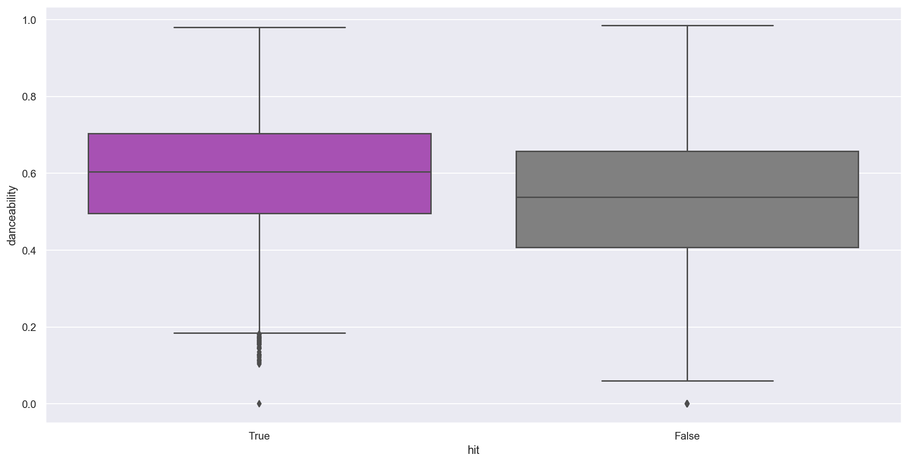

    Hits Mean: 0.5957135504885993
    Non-Hits Mean: 0.5295059136044526
    Mean Diff: 0.06620763688414666
    H0 Diff: 0

We can see some difference between the means of the two distributions but without a statistical significance test we can't be sure that this difference isn't simply due to chance of the sample and that the distributions are in fact the same.

To better understand whether the distributions are statistically significantly different we'll use a Z-Test and Permutation.

    H0: The Danceability Distribution for Hits and Non-Hits is the same (i.e. the mean diff is 0).
    H1: The Danceability Distribution for Hits and Non-Hits is not the same.
    alpha = 0.05

---

    p: 0.0
    CI: [-0.00384252  0.0037603 ]
    ME: 0.003786297754012112

    /Users/sebastian/anaconda3/envs/hit_predictor/lib/python3.6/site-packages/scipy/stats/stats.py:1713: FutureWarning: Using a non-tuple sequence for multidimensional indexing is deprecated; use `arr[tuple(seq)]` instead of `arr[seq]`. In the future this will be interpreted as an array index, `arr[np.array(seq)]`, which will result either in an error or a different result.
      return np.add.reduce(sorted[indexer] * weights, axis=axis) / sumval

Looking at the trial above it's clear that the mean difference is statistically significant. This is not surprising, due to the largeness of the sample but the exceptionally low p-value is positive evidence that we might be on the right track here and that there is some predictive information. 

Given the results above, we can reject H0 and have gathered evidence to support H1. The data indicates that hits tend to be more 'danceable'.

Due to the large sample size most differences are likely statistically significant, for interesting cases I've conducted a test below otherwise most of these relationships are tested in _\_Step 3 - Inferential Statistical Tests_ and _\_Step 4 - Building a Model_

### 4.2.2 Energy and Acousticness

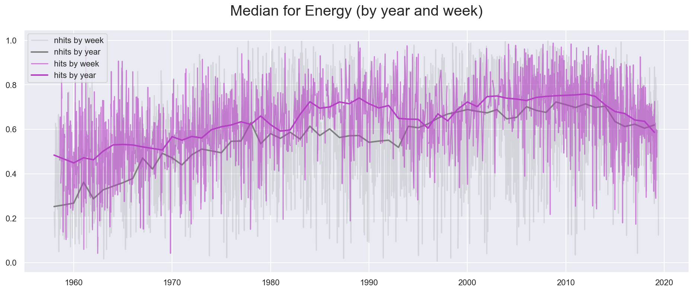

_"Energy [...] represents a perceptual measure of intensity and activity. Typically, energetic tracks feel fast, loud, and noisy."_  [Spotify Track Features Description](https://developer.spotify.com/documentation/web-api/reference/tracks/get-audio-features/)

Energy as a feature looks like a less clear-cut situation. First of all, there is a lot more overlap in by week medians of hits and non-hits. Furthermore, the median Energy levels by year have started to close in between hits and non-hits in recent years. Nevertheless, starting in the early 1980s we're starting to see a stronger focus (lower variability) on high-energy songs compared to the early 1960s.

Again, just as with danceability we can see variability picking up in the mid- to late-2000s. Energy levels were at their all-time highs from the early 1980s until the 2010s (an exception were the mid- to late-1990s). Starting in the early 2010s, however, we're seeing less energetic songs getting the upper hand. In fact, the Hot 100s median energy levels have dropped below non-hits in 2019 for the third time since its inception.

For our model, we're witnessing again that higher energy levels seem to indicate a higher likelihood of Hit potential than low energy levels. Similarly this has been quite consistently the case starting mid-1970s to the mid-2010s. The general difference will be checked for significance in the _inference analysis_.

To get a feeling for what songs are considered high energy, we're listing the top 10 most energetic songs below.

_"[Acousticness is] a confidence measure from 0.0 to 1.0 of whether the track is acoustic."_  [Spotify Track Features Description](https://developer.spotify.com/documentation/web-api/reference/tracks/get-audio-features/)

As a comparison I've plotted the development of acousticness confidence below the energy plot. We can see that acousticness confidence and variability decrease in the late 1970s and are on historic lows in the 1980s throughout the 1990s and until the mid 2000s (with a few exceptions). 

Energy and Acousticness are not necessarily opposite sides of the same relationship but both of them share a drastic change. Energy on one end has enjoyed a meteoric rise in the 1980s, acousticness has dropped drastically in the 1980s, variability and median in acousticness have recently picked back up while energy has started to drop in recent years. Unfortunately, our analysis of the negative relationship between these two features is limited as Spotify does not release a detailed break-down of their features.

In both cases we seem to be looking at one or several bigger trends as hits and non-hits are moving in the same direction but with hits having fewer variability it looks like these two features could carry a lot of explanatory information especially for the period between 1980s and 2000s. The overlap between hits and non-hits is much larger before or after the period just mentioned.

<table border="1" class="dataframe">
  <thead>
    <tr style="text-align: right;">
      <th></th>
      <th></th>
      <th>date</th>
      <th>energy</th>
      <th>hit</th>
      <th>peak</th>
    </tr>
    <tr>
      <th>artist</th>
      <th>title</th>
      <th></th>
      <th></th>
      <th></th>
      <th></th>
    </tr>
  </thead>
  <tbody>
    <tr>
      <th>Culture Beat</th>
      <th>Mr. Vain</th>
      <td>1993-12-18</td>
      <td>0.997</td>
      <td>True</td>
      <td>17.0</td>
    </tr>
    <tr>
      <th>Five Finger Death Punch</th>
      <th>Under And Over It</th>
      <td>2011-08-20</td>
      <td>0.996</td>
      <td>True</td>
      <td>77.0</td>
    </tr>
    <tr>
      <th>Jane's Addiction</th>
      <th>Just Because</th>
      <td>2003-08-09</td>
      <td>0.996</td>
      <td>True</td>
      <td>72.0</td>
    </tr>
    <tr>
      <th>Guns N' Roses</th>
      <th>Nightrain</th>
      <td>1989-08-26</td>
      <td>0.995</td>
      <td>True</td>
      <td>93.0</td>
    </tr>
    <tr>
      <th>Suzi Quatro</th>
      <th>I've Never Been In Love</th>
      <td>1979-09-22</td>
      <td>0.995</td>
      <td>True</td>
      <td>44.0</td>
    </tr>
    <tr>
      <th>The Chemical Brothers</th>
      <th>Setting Sun</th>
      <td>1997-02-15</td>
      <td>0.995</td>
      <td>True</td>
      <td>80.0</td>
    </tr>
    <tr>
      <th>Bananarama</th>
      <th>Love, Truth &amp; Honesty</th>
      <td>1988-12-03</td>
      <td>0.994</td>
      <td>True</td>
      <td>89.0</td>
    </tr>
    <tr>
      <th>Go-Go's</th>
      <th>We Got The Beat</th>
      <td>1982-05-15</td>
      <td>0.994</td>
      <td>True</td>
      <td>2.0</td>
    </tr>
    <tr>
      <th>Jimmy Ruffin</th>
      <th>Hold On To My Love</th>
      <td>1980-04-12</td>
      <td>0.994</td>
      <td>True</td>
      <td>10.0</td>
    </tr>
    <tr>
      <th>Metallica</th>
      <th>Cyanide</th>
      <td>2008-09-20</td>
      <td>0.993</td>
      <td>True</td>
      <td>50.0</td>
    </tr>
  </tbody>
</table>

### 4.2.3 Loudness

_"The overall loudness of a track in decibels (dB). Loudness values are averaged across the entire track and are useful for comparing relative loudness of tracks."_  [Spotify Track Features Description](https://developer.spotify.com/documentation/web-api/reference/tracks/get-audio-features/)

As a feature, loudness is very consistently flat before the 1990s and then again starting in the early 2000s (i.e. at a higher level). We can clearly see that in the 1990s something in music changed, more and more songs were created that had a relatively higher loudness.

In general, we see that hits are having a higher median loudness but especially in the last few years we're seeing that hits and non-hits loudness do not diverge much anymore.

<table border="1" class="dataframe">
  <thead>
    <tr style="text-align: right;">
      <th></th>
      <th></th>
      <th>date</th>
      <th>loudness</th>
      <th>hit</th>
      <th>peak</th>
    </tr>
    <tr>
      <th>artist</th>
      <th>title</th>
      <th></th>
      <th></th>
      <th></th>
      <th></th>
    </tr>
  </thead>
  <tbody>
    <tr>
      <th>Lana Cantrell</th>
      <th>Like A Sunday Morning</th>
      <td>1975-03-01</td>
      <td>2.291</td>
      <td>True</td>
      <td>63.0</td>
    </tr>
    <tr>
      <th>Diplo, French Montana &amp; Lil Pump Featuring Zhavia Ward</th>
      <th>Welcome To The Party</th>
      <td>2018-06-02</td>
      <td>0.175</td>
      <td>True</td>
      <td>78.0</td>
    </tr>
    <tr>
      <th>Metallica</th>
      <th>Cyanide</th>
      <td>2008-09-20</td>
      <td>-0.463</td>
      <td>True</td>
      <td>50.0</td>
    </tr>
    <tr>
      <th>Diana Ross &amp; The Supremes</th>
      <th>Some Things You Never Get Used To</th>
      <td>1968-06-08</td>
      <td>-0.507</td>
      <td>True</td>
      <td>30.0</td>
    </tr>
    <tr>
      <th>Eminem</th>
      <th>Cold Wind Blows</th>
      <td>2010-07-10</td>
      <td>-0.517</td>
      <td>True</td>
      <td>71.0</td>
    </tr>
    <tr>
      <th>Luke Bryan</th>
      <th>Move</th>
      <td>2016-12-10</td>
      <td>-0.698</td>
      <td>True</td>
      <td>50.0</td>
    </tr>
    <tr>
      <th>Diana Ross &amp; The Supremes</th>
      <th>Love Child</th>
      <td>1968-11-23</td>
      <td>-0.810</td>
      <td>True</td>
      <td>1.0</td>
    </tr>
    <tr>
      <th>Eminem</th>
      <th>Insane</th>
      <td>2009-06-06</td>
      <td>-0.883</td>
      <td>True</td>
      <td>85.0</td>
    </tr>
    <tr>
      <th>Barenaked Ladies</th>
      <th>Too Little Too Late</th>
      <td>2001-04-28</td>
      <td>-0.884</td>
      <td>True</td>
      <td>86.0</td>
    </tr>
    <tr>
      <th>Eminem</th>
      <th>25 To Life</th>
      <td>2010-07-10</td>
      <td>-0.945</td>
      <td>True</td>
      <td>92.0</td>
    </tr>
  </tbody>
</table>

I believe especially Lana Cantrell's Like A Sunday Morning is a good example of an older song that falls into the loud category, while Cold Wind Blow by Eminem might be a good example for a newer song. _see examples above_

### 4.2.4 Speechiness

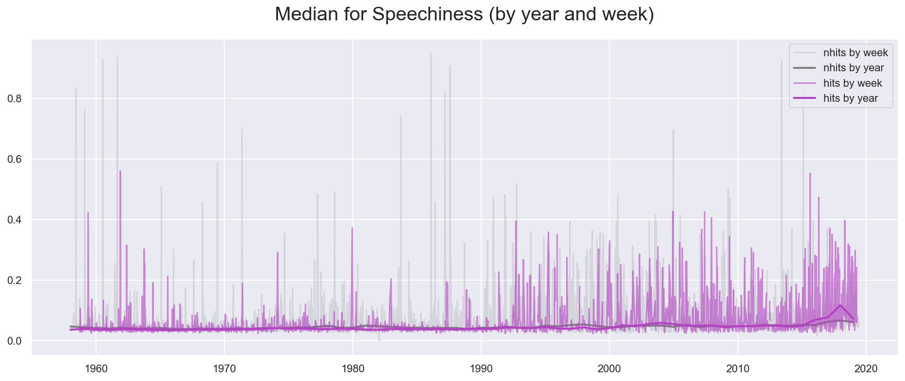

_"Speechiness detects the presence of spoken words in a track. The more exclusively speech-like the recording (e.g. talk show, audio book, poetry), the closer to 1.0 the attribute value. Values above 0.66 describe tracks that are probably made entirely of spoken words."_  [Spotify Track Features Description](https://developer.spotify.com/documentation/web-api/reference/tracks/get-audio-features/)

For Speechiness we can see an upward trend starting in the 1990s, with an increased density of high speechiness weeks and generally more high points, often going past 0.2 median (a rarety before 1990 but a common occurrance afterwards).

It's hard to pin-point what Speechiness is actually measuring as we're looking at the songs with the highest Speechiness. I would've assumed that the highest Speechiness would be found in Rap songs but judging from it there is a good mix of Country, Pop and Hip Hop music. This feature doesn't seem to be all that helpful for our analysis for now. There is no clear indicators and the feature itself is quite obtuse. With a lack of additional information of how this feature is put together, I've decided to abandon the feature for now.

<table border="1" class="dataframe">
  <thead>
    <tr style="text-align: right;">
      <th></th>
      <th></th>
      <th>date</th>
      <th>speechiness</th>
      <th>hit</th>
      <th>peak</th>
    </tr>
    <tr>
      <th>artist</th>
      <th>title</th>
      <th></th>
      <th></th>
      <th></th>
      <th></th>
    </tr>
  </thead>
  <tbody>
    <tr>
      <th>Chris Young Duet With Cassadee Pope</th>
      <th>Think Of You</th>
      <td>2016-05-14</td>
      <td>0.951</td>
      <td>True</td>
      <td>40.0</td>
    </tr>
    <tr>
      <th>Wu-Tang Clan</th>
      <th>C.R.E.A.M. (Cash Rules Everything Around Me)</th>
      <td>1994-04-09</td>
      <td>0.950</td>
      <td>True</td>
      <td>60.0</td>
    </tr>
    <tr>
      <th>Taylor Swift</th>
      <th>Should've Said No</th>
      <td>2008-06-21</td>
      <td>0.941</td>
      <td>True</td>
      <td>33.0</td>
    </tr>
    <tr>
      <th>Hudson and Landry</th>
      <th>Ajax Airlines</th>
      <td>1972-01-22</td>
      <td>0.924</td>
      <td>True</td>
      <td>68.0</td>
    </tr>
    <tr>
      <th>Reba McEntire</th>
      <th>I'll Be</th>
      <td>2000-07-01</td>
      <td>0.924</td>
      <td>True</td>
      <td>51.0</td>
    </tr>
    <tr>
      <th>Stan Freberg</th>
      <th>The Old Payola Roll Blues (Side I)</th>
      <td>1960-02-29</td>
      <td>0.919</td>
      <td>True</td>
      <td>99.0</td>
    </tr>
    <tr>
      <th>Hudson and Landry</th>
      <th>Ajax Liquor Store</th>
      <td>1971-07-03</td>
      <td>0.913</td>
      <td>True</td>
      <td>43.0</td>
    </tr>
    <tr>
      <th>Cheech &amp; Chong</th>
      <th>Sister Mary Elephant (Shudd-Up!)</th>
      <td>1974-01-12</td>
      <td>0.882</td>
      <td>True</td>
      <td>24.0</td>
    </tr>
    <tr>
      <th>Steve Martin</th>
      <th>Grandmother's Song</th>
      <td>1977-12-10</td>
      <td>0.858</td>
      <td>True</td>
      <td>72.0</td>
    </tr>
    <tr>
      <th>Dickie Goodman</th>
      <th>The Touchables In Brooklyn</th>
      <td>1961-05-29</td>
      <td>0.847</td>
      <td>True</td>
      <td>42.0</td>
    </tr>
  </tbody>
</table>

### 4.2.5 Valence

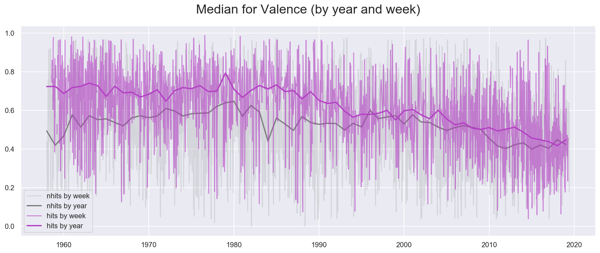

_A measure from 0.0 to 1.0 describing the musical positiveness conveyed by a track. Tracks with high valence sound more positive (e.g. happy, cheerful, euphoric), while tracks with low valence sound more negative (e.g. sad, depressed, angry)._ [Spotify Track Features Description](https://developer.spotify.com/documentation/web-api/reference/tracks/get-audio-features/)

Valence is quite an interesting indicator as it attempts to measure positivity of music. In turn, we can see that the Hot 100 were generally more positive than non-hits all the way through the mid-1990s until Hot 100 drop down in valence in 1995 and then slowly continue to decrease to its current low-point having almost now visible difference between Hot 100 and Non-Hits.

Knowing that Valence has more and more decreased it might be interesting to see the songs with the highest and lowest valence.

<table border="1" class="dataframe">
  <thead>
    <tr style="text-align: right;">
      <th></th>
      <th></th>
      <th>date</th>
      <th>valence</th>
      <th>hit</th>
      <th>peak</th>
    </tr>
    <tr>
      <th>artist</th>
      <th>title</th>
      <th></th>
      <th></th>
      <th></th>
      <th></th>
    </tr>
  </thead>
  <tbody>
    <tr>
      <th>Eddie Hodges</th>
      <th>I'm Gonna Knock On Your Door</th>
      <td>1961-07-10</td>
      <td>0.991</td>
      <td>True</td>
      <td>12.0</td>
    </tr>
    <tr>
      <th>Four Tops</th>
      <th>It's The Same Old Song</th>
      <td>1965-08-21</td>
      <td>0.991</td>
      <td>True</td>
      <td>5.0</td>
    </tr>
    <tr>
      <th>War</th>
      <th>Low Rider</th>
      <td>1975-10-25</td>
      <td>0.990</td>
      <td>True</td>
      <td>7.0</td>
    </tr>
    <tr>
      <th>Katrina And The Waves</th>
      <th>Que Te Quiero</th>
      <td>1985-11-09</td>
      <td>0.989</td>
      <td>True</td>
      <td>71.0</td>
    </tr>
    <tr>
      <th>John Sebastian</th>
      <th>Hideaway</th>
      <td>1976-07-31</td>
      <td>0.988</td>
      <td>True</td>
      <td>95.0</td>
    </tr>
  </tbody>
</table>

---

<table border="1" class="dataframe">
  <thead>
    <tr style="text-align: right;">
      <th></th>
      <th></th>
      <th>date</th>
      <th>valence</th>
      <th>hit</th>
      <th>peak</th>
    </tr>
    <tr>
      <th>artist</th>
      <th>title</th>
      <th></th>
      <th></th>
      <th></th>
      <th></th>
    </tr>
  </thead>
  <tbody>
    <tr>
      <th>Georgie Young</th>
      <th>Nine More Miles (The "Faster-Faster" Song)</th>
      <td>1958-11-03</td>
      <td>0.0000</td>
      <td>True</td>
      <td>58.0</td>
    </tr>
    <tr>
      <th>Coldplay</th>
      <th>Midnight</th>
      <td>2014-05-10</td>
      <td>0.0349</td>
      <td>True</td>
      <td>29.0</td>
    </tr>
    <tr>
      <th>A$AP Rocky</th>
      <th>L$D</th>
      <td>2015-06-13</td>
      <td>0.0352</td>
      <td>True</td>
      <td>62.0</td>
    </tr>
    <tr>
      <th>The Pipes And Drums And The Military Band Of The Royal Scots Dragoon Guards</th>
      <th>Amazing Grace</th>
      <td>1972-07-01</td>
      <td>0.0359</td>
      <td>True</td>
      <td>11.0</td>
    </tr>
    <tr>
      <th>Drake</th>
      <th>Jaded</th>
      <td>2018-07-21</td>
      <td>0.0371</td>
      <td>True</td>
      <td>32.0</td>
    </tr>
  </tbody>
</table>

The highest valence songs are between 1961 and 1985, the lowest valence songs are a little more spread out but it's striking that 3 of the top 5 lowest valence songs were released in the 2010s. That being said Georgie Young might actually be an outlier and mislabeled.

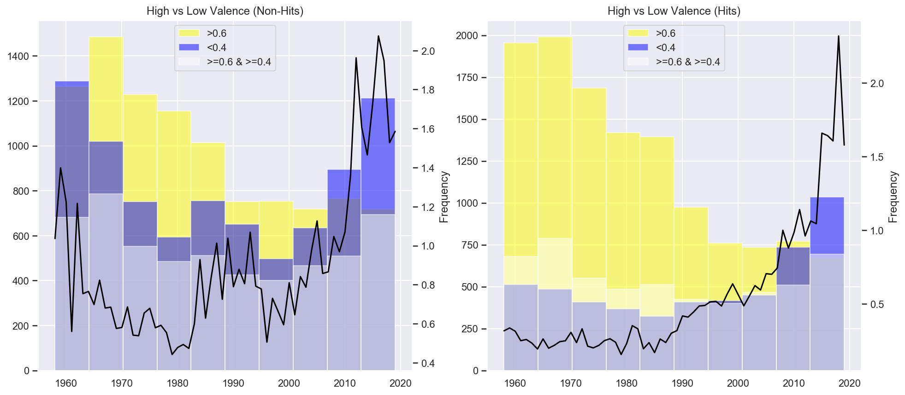

_NOTE: To avoid using an arbitrary cut-off point such as 0.5, I've introduced a neutral category for valence levels between 0.4 - 0.6._

While there is also a higher percentage of low valence music among Non-Hits the distinction between High-Valence and Low-Valence songs in the Hot 100 is a stark contrast if looked at across time. The number of low-valence songs in the Hot 100 before 2010 is consistently low while the high valence songs are dropping at a more or less linear-looking rate starting in the 1970s all the way through the 2000s. In the 2010s, low-valence songs are catching up with high-valence songs for the first time and in the 2020s low-valence surge beyond high-valence songs. Both Non-Hits and Hits are at an all-time high for low-valence songs.

The graphs show that we're increasingly listening to less positive sounding music in our Hot 100 charts as well as in our general popular music.

### 4.2.6 Instrumentalness

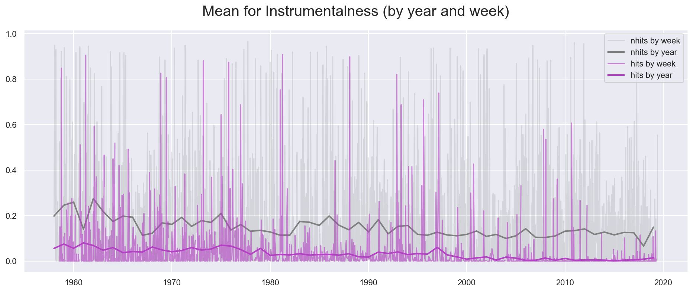

_Instrumentalness predicts whether a track contains no vocals. [...] The closer the instrumentalness value is to 1.0, the greater likelihood the track contains no vocal content._  [Spotify Track Features Description](https://developer.spotify.com/documentation/web-api/reference/tracks/get-audio-features/)

Instrumentalness basically detects the vocal to instruments ratio. Rap songs are closer to 0 while classical music can be found at values > 0.5. It is an interesting feature due to the fact that the Hot 100 are strongly partial toward non-instrumental songs. This makes sense, especially in recent time, with the rise of Rap music but interestingly we can observe in the chart above that there has been a strong bias toward less instrumental songs throughout the entire history of the Hot 100. 

Another reason that makes this potentially interesting for Hot 100 detection is the fact that there are significant amounts of non-hits that fall into the instrumental category.

To better understand whether the distributions are statistically significantly different we'll use a Z-Test.

- **H0**: The Instrumentalness Distribution for Hits and Non-Hits is the same (i.e. the mean diff is 0).
- **H1**: The Instrumentalness Distribution for Hits and Non-Hits is not the same.
- **alpha** = 0.05

    Hits Mean: 0.03421712542280131
    Non-Hits Mean: 0.15391891948833092
    Mean Diff: -0.11970179406552961
    H0 Diff: 0
    p: 0.0
    CI: [-0.00534099  0.00530983]
    ME: 0.0053006576330059795

The p-value for the Point Estimate occuring if Hits and Non-Hits were equally distributed is <0.05 and we can therefore reject H0 and accept H1. The distributions are significantly different for p<0.001. Hence, we can consider using this feature in our model.

### 4.2.7 Duration (in ms)

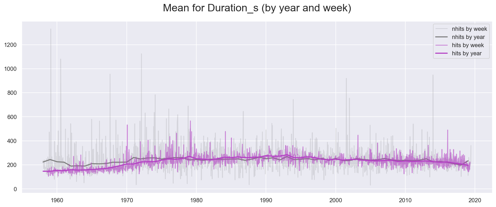

_The duration of the track in milliseconds._ [Spotify Track Features Description](https://developer.spotify.com/documentation/web-api/reference/tracks/get-audio-features/)

The duration of a track could be a good feature since the Hot 100 are looking at airplay on radios which have historically favored songs that have a specific length. To get a more intuitive sense the data has been downsampled to seconds. We can see that songs that made it onto the Hot 100 were generally not longer than 3 minutes but starting in the 1970s the average length of a track has gotten slightly longer (i.e. around the 4-minute mark), indicating a higher tolerance of radio to accept slightly longer tracks. However, we can see that non-hits while also having scaled down slightly, closer to the 4-minute mark there is stil a lot of songs that are significantly longer or shorter than the Hot 100 songs.

### 4.2.8 Discrete Variables

It's clear that `time_signature`, `key` and `mode` don't hold much value for us using the median as a summary statistic. Hence, we're going to look at them in a countplot.

We can see general tendencies:
    - More than 2/3 of songs are written in Major
    - Most songs are written predominantly with a 4 time signature
    - Full keys (e.g. C,D,E or F) are relatively more popular than keys using semitones (e.g. C#,D# or F#)

Beyond that unfortunately it doesn't look like we can make out any major differences between hits and non-hits using these features. While these differences might still be statistically significant we'll have to check whether they hold enough predictive information to be used in a model.

### 4.2.9 Conclusion

We've seen that multiple features (e.g. Danceability, Energy, Loudness, Instrumentalness and Valence) show quite interesting discrepancies to Non-Hits. Most of the discrepancies are within the spectrum of all songs, as would be expected. After all, hits are simply a subset of songs that are released every day. It would make sense that Hit songs are more streamlined and generally more prone to follow trends. We can see this especially during the 1990s and 2000s. Most of the features are narrowing into subsections of the entire spectrum of available popular music.

We were also able to make out distinct trends for certain time periods (e.g. before 1980s, between 1990s and 2000s or after the 2000s).

With these tools in-hand we're going to create a Machine Learning Model to predict the potential for a Song to become a hit.

-------------------------------------------------

# 5. The Inferential Statistical Analysis

The section on inferential statistics is looking at statistical significance on observations made and thoughts had during the EDA. This is an essential step to understanding whether or not the differences between hits and non-hits are factual or just happened by chance.

The focus for us lies on three categories:
- Distribution between Hits and Non-Hits
- Correlation with the Target Variable (i.e. hit or non-hit)
- Collinearity between features

## 5.1 Challenges

#### Normality

One of the biggest challenges for this project was the lack of available normally distributed data. Normally distributed data is often a requirement for classical statistic tests. Luckily, the Central Limit Theorem is helping us to use the Z-Test to compare distribution differences anyways.

#### Statistical and Practical Significance

Due to the large sample sizes even the slightest differences can be considered statistically significant but might not actually allow us to use a feature for our model as their predictive qualities are limited. As in many other cases we need to rely on a combination of staistical test and also sound reasoning for model building.

#### Preprocessed Features

As we're relying on features that are preprocessed and aggregated by Spotify we're looking at features that are obtuse and abstract features. While this allows for intuitive interpretations, we're losing some of the interpretability as Spotify doesn't allow us to fully understand how these features come together.

## 5.2 Features Tested

From what I can tell we have two different categories of features:
- Continuous Features (e.g danceability, instrumentalness etc.)
- Discrete Features (e.g. time signature, key etc.)

#### Continuous Features

In many ways hit prediction is about finding the subtle differences and similarities between hits and non-hits, continuous features tend to be much more valuable in uncovering those differences and trends across time which is why the first part of the inferential statistics tests were focused on those features. 

#### Distributions

To understand whether the differences between hits and non-hits observed are significant, I've conducted Z-tests for distributions on the following features (only continuous variables included):
- acousticness
- loudness
- instrumentalness
- danceability
- valence
- energy
- tempo
- duration_ms

The method was to compare mean differences across 10000 permutations and then check whether the mean difference of the observed distributions would fall into the realm of significant possibilities. For all features above, the probability (p-value) was \<0.001, allowing me to reject the null hypothesis (H0) that hit and non-hits were equally distributed. 

#### Correlation

Different from exploring correlation between continous variables the process of determining feature importance with categorical variables via continuous variables is much trickier. For this project we've used logistic regression (using Pearson's r would've yielded dubious results at best - try drawing a linear regression line through a binary outcome and you'll understand why pearson's r won't be a suitable tool)

Using Logistic Regression Beta based on standardized values allowed us to evaluate the relative importance of the features used. We can see at the top are three features to detect hits:
- Instrumentalness
- Acousticness
- Loudness

At the bottom we can see two features:
- Tempo
- Key

Interestingly, a continuous feature such as tempo seems to have very little influence on whether the model can become a hit or not. It might be interesting to see, if Tempo would perform better if the model was taking time/year into account. The Key feature expectedly scores low in weight, no surprise there.

We can also see that 
- Mode 
- Time Signature 

are performing better than expected. However, as we've evaluated in the EDA Mode and Time Signature features aren't convincing features, these could quickly change and might overfit our model rather than leading to actual higher accuracy.

Hence, we'll drop Tempo, Mode, Key and Time Signature.

#### Collinearity

For collinearity measurements we've used the popular Pearson correlation coefficient (i.e. Pearson's r). Even though this couldn't be used for describing relationships between continuous predictor and discrete target variable, it's a good metric to detect collinearity between predictors. A characteristic of multiple features standing relation to each other is an issue because our assumption is that each feature is an _independent_ variable, correlation, however implies that with a change in one variable it affects another making the relationship with the target variable increasingly murky. This has drastic implications for the stability of our model which can be read about in further detail [_here_](https://statisticsbyjim.com/regression/multicollinearity-in-regression-analysis/). 

I've found strong correlation (~0.8) between `energy` and `acousticness` and `energy` and `loudness`. Somewhat present correlations (~0.6) were also visible between `acousticness` and `loudness` as well as `valence` and `danceability`. All four correlations were statistically significant for p<0.001 but as the correlations were only moderately strong for some features and removing them might've removed some actual information about a song's content, I decided to use dimension reduction through PCA instead.

#### Conclusion

In conclusion, we'll be using a combination of the features below to describe a song's content. To take care of collinearity issues we're using dimensionality reduction (in our case using PCA).

- Acousticness
- Loudness
- Instrumentalness
- Danceability
- Valence
- Energy
- Duration_ms

In the Machine Learning section we'll be looking at multiple different ML algorithms, Cross Validation and Performance metrics to optimize the predictive qualities of our model.

# 6. The Model
- Dimmensionality Reduction (PCA)
- Algorithms (Knn, RF)
- Performance Metrics (PR, ROC)    
    - Cross Validation/ Hyper Parameter Optimization
    - Precision Recall / ROC AUC

# 7. Conclusion