# 1. The Problem

In recent years, a new field has (re-)emerged that attempts to use audio features to predict whether a song will achieve commercial success - Hit Song Science (HSS).

At the core of this challenge lies the urge to create a better understanding of what intrinsic music features contribute to the popularity of certain music pieces. This would allow us a deeper understanding of the components of popularity in music.

There are claims of a relationship between some intrinsic music features and a song's popularity. For example, songs that have many repetitions tend to enjoy elevated popularity. There's also a case to be made that familiarity plays a factor in popularity (i.e. songs tend to form groups, which we commonly refer to as genres). These are a just few examples but it's enough for me to be intrigued by the idea that there is such a thing as a formula for a Hit song. At least to some extent we should be able to understand whether a song is a possible Hit or not by looking at its features.

Now, there are certainly those cynic voices that will claim that popular music is only created through celebrity and marketing. To some extend that's likely true, extrinsic factors shouldn't be dismissed outright, they probably have an impact on the ability for a song to become a Hit. Otherwise, it would be unlikely to see continuous investments into marketing and brand building. However, for this project I've decided to look solely at the intrinsic audio features of songs.

The problem is not just a one-sided issue. While it's a challenge to model the description of a song with numbers and categories, it might be just as much of a challenge to decide what is a popular song. It's tough to understand what drives popularity. Popularity could be seen as a continuous measure, an ordinal measure or a binary. All of these pose obvious individual problems but one problem they all have in common is what factors go into the term of popularity and how to weigh them. Often we're left using approximations of popularity. In our case we're going to focus on commercial success as an approximation to popularity as it makes the most sense if we're looking at this problem from a business perspective. Additionally, commercial success is a lot easier to quantify and has more resources readily available.

This is a very exciting project for myself and I hope you'll enjoy the journey as well.

# 2. The Client

Solving the problem of Hit Song Prediction is not only an interesting scientific challenge that could help us understand the inner workings of popularity. It could also lead to very tangible business benefits.

**Record Label Industry**:
In many ways the risks and rewards structure of the traditional book publishing industry applies to the music industry as well. In general terms, a record label signs on a new artist based on the experience of the A&R department, some circumstential evidence and increasingly evidence from prior success through self-publishing and self-promotion. The upfront investments in these artists is often substantial and generally ranges from a few hundred thousand USD to multiple million USD. These investments often include a debut album or increasingly mini-albums, both of which requires song selection. Choosing the right song for a publishing item can be crucial to the future success of an artist, especially in the early parts of their career. A tool for predicting the chance of commercial success based on its intrinsic characteristics has many potential benefits:

- Support in the song selection process
- Allows for more calculated risks and diversified portfolios
- Generates feedback for the A&R department when signing on a new artist
- Feedback for songwriters in their daily work

**Radio Stations**
Programming of radio stations is increasingly important, especially with the rise of streaming services taking up more and more market share. Most of us have experienced a radio station not playing a song we like, followed by the immediate reaction to switch to a different station. For linear media, such as radio stations, it is therefore important to consistently Hit our taste profile. Hit song prediction can help with this issue.

Programming of radio stations is often history-focused, whether that is by choosing only songs from the Top 40 or artists that have already gained popularity in the past and sticking to their portfolio. A Hit Song predictor would allow radio stations to reduce the quantity of songs that fall into the realm of possibilities without having to stick to established artists or other suboptimal guidelines. This would allow for more time in creating valuable programming.

There are likely several additional use cases in the streaming market, for brick-and-mortar stores etc. that can be thought of.

# 3. The Data

The data used in this project was acquired from two sources: Billboard.com and the Spotify API

The Billboard Hot 100 goes back to 1958 and was the main source to identify 'popular' tracks. It is commonly used in scientific studies and a common indicator of success for the music industry. 

The data was acquired from the site running a script that requested and parsed the weekly lists. The first time the Hot 100 were released was on August 4th, 1958 and the last date included in this analysis is April 8th, 2019. The data includes Title, Artist, Position/Rank on the Hot 100 and Date of the Positioning on the Hot 100.

The Spotify API was used for two purposes to enrich the Hot 100 data with more audio features using the [Audio Features endpoint](https://developer.spotify.com/documentation/web-api/reference/tracks/get-several-audio-features/) and to create a balanced data set of songs that were released at the time of the Hot 100 songs but _didn't_ make it onto the chart. 

The following files were used in the project:

1. hot100.csv - Containing the Hot 100 data since 1958 enriched with performance metrics by title. This file includes 3167 weeks worth of Hot 100 songs.
2. hits_uniq.csv - Containing Hot 100 data that could be matched with Audio Features from the Spotify API. This file includes a total of 21002 songs.
3. nhits_uniq.csv - Containing Non-Hits data sampled from the Spotify API using the by year distribution of the Hot 100 data as a baseline number of songs.

## 3.1 Data Collection

The data from the Billboard Hot 100 was a straight-forward task. I wrote a custom scraper requested the raw html (at 10 second intervals) and parsed it using Beautiful Soup.

Using the distribution of unique songs by year, I generated a second data set of songs that would mirror the Hits listed in the Hot 100 with Non-Hits that were released around the same time (accurate to the year). The data was generated using the Search endpoint and randomly sampling chunks of the first 10000 results (50 songs at a time) and ~20% of the data was sampled from the bottom 10% of search results (least popular songs). Spotify provides a specific tag for that specific purpose (i.e. `tag:hipster`).

The more challenging task was matching artist names and titles to appropriate songs in the Spotify Database. Due to the limited amount of information provided by the Hot 100 charts the Spotify API would be able to match one Hot 100 song with multiple instances in their database. For the songs I was able to match, I created a list of audio features using the relevant Spotify Endpoint.

## 3.2 Data Wrangling

**Overview**
This section describes the various data cleaning and data wrangling methods applied to the Hot 100 and Non-Hits data. 

**Summary Files**
The results of the Hot 100 scraper and Audio Feature endpoint resulted in separate files, as that allowed for partial processing, abrupt shutdowns and intermediate saving. For analysis purposes and faster processing these files were merged into comprehensive dataframes or actual summary files (e.g. 'data/interim/hot100_songs.csv'). 

**Performance Features for Exploratory Data Analysis**
The Hot 100 data was very slender. In order to make the later EDA phase easier, I added a few additional performance metrics to the data:

- reentry - Total number of reentries (NaN was used for titles that have no reentries)
- streak - Consecutive weeks a song ranked
- ranked - Total Number of Times a song ranked
- entry - Position it first appeared
- exit - Position it last appeared
- peak - Highest Position
- low - Lowest Position

**Splitting Timestamps into Year, Month, Day Columns**
To allow for easier grouping by time periods all available dates were copied and split up into a year, month and day column.

**Duplicates and Missing Values**
For the analysis of Hits vs. Non-Hits, it was necessary to remove duplicates from the Hot 100 data using the `artist` and `title` columns. For each duplicate the first occurrence on the Hot 100 charts was kept, in the previous step entry and exit date columns were added to keep most of the relevant data without causing processing issues due to large files.

The Hits dataset also had a lot of missing values due to the inability of correctly matching a song with a Spotify ID or it not being available in the Spotify Database. The loss ranged from below 40% to above 15%, this is a significant loss of data. However, for our purposes it was absolutely necessary to access rich audio features as we're attempting a content-based analysis. The missing values couldn't be easily replaced due to copyright restrictions and extensive time commitment that was outside the scope of this project. The observations that couldn't be matched with Spotify Ids had to be dropped entirely.

In this case the Spotify features had no obvious null values as a 0 also had interpretative power. 

**Inconsistent Naming in Title and Artists**
As mentioned above string matching was the major challenge in this project's wrangling stage. Artists are often collaborating for songs but the naming conventions vary from artist to artist and platform to platform. Therefore I've created unified conventions "&" or "FEATURING" was generalized to "AND", titles and artists were transformed to upper case letters, ",-'" were all generalized to single spaces, lastly accents and other special characters were either simplified or removed. 

Subsequently the majority of records was classified a match or a non-match using a 2-n-gram distance ([similarity library](https://github.com/luozhouyang/python-string-similarity)). The remaining entries were manually verified. 

**Merge**
In the final step the audio features were merged respectively with the Hot 100 data and the Non-Hits data and a few visualizations were created to ensure the wrangling had not unexpectedly affected our data.

See:
    [Wranling Notebook](https://github.com/Germoe/hit-predictor/blob/master/notebooks/_Step%201%20Wrangling%20(Hot%20100%20and%20Spotify%20Sample).ipynb)

# 4. The Exploratory Data Analysis (EDA)

Exploring our data will be split into two stages. First, we'll have a close look at the historic data of the Hot 100 to better understand the underlying quirks in how it comes together, identifying possible issues or opportunities for model-building and general curiosity of the history of the Hot 100. Second, we're looking at the audio features from Hits (a subset of the Hot 100) and a sample of Non-Hits (see _Data_ for more information).

## 4.1 History of Hot 100

Started by Billboard Magazine the Billboard Hot 100 is the industry standard record chart in the United States. It is published on a weekly basis.

Chart rankings are based on sales (physical and digital), radio play, and online streaming in the United States. If we define success of a song as commercial success, the charts are a way to understand the mainstream popularity/market value of a song.

It should also be noted that the Billboard Hot 100 is not the most accurate tool for identifying all commercially successful songs as their rules and tracking tools are subject to flaws. A common example of this is their policy to not include songs that weren't released as singles (revoked in 1998). This led to some of the most commercially successful songs never making it onto the Hot 100 (e.g. No Doubt's Don't Speak). Another drawback is simply the arbitrary cut-off at 100 songs a week, artificially limiting/inflating the amount of possible Hits at any given point. Nevertheless, it's the best tool we have readily available.

We'll start by looking into the frequency of songs in the Hot 100 through the years.

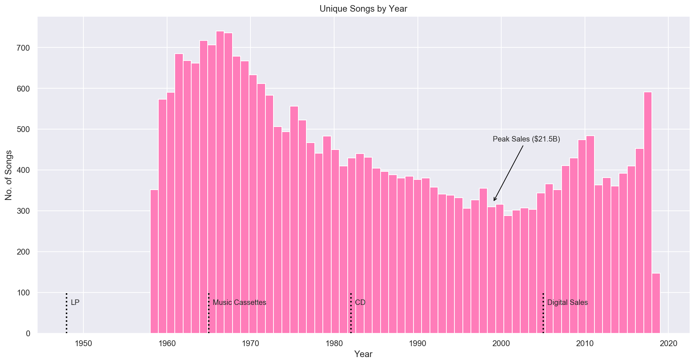

    Since 1958 there were *28083* songs on the Billboard Hot 100.

It looks like starting in the late 1960s songs stayed on the Billboard Hot 100 for increasingly long periods (streak length increased) and we had less fluctuation (i.e. new songs entering and old songs dropping off). However, in more recent years, starting in 2005, this fluctuation seems to be picking back up again. 

The graph is annotated with significant changes in the music medium and sales revenue (RIAA) to provide context. The recent increase of unique songs starts in the mid 2000s and follows the integration of digital sales into the Hot 100 formula. A possible explanation for an increase here could be that with digital sales it was possible for the first time to only buy a single song instead of having to buy the official single. This was possible for around 99 cents instead of the usual pricing for a single between 5-15 USD, resulting in a lowering of the financial hurdle to increase the sales numbers of a single song.

One of the lowest fluctuation points also coincides with the high point of sales in the music industry, also commonly known as the year in which Napster disrupted the music industry.

### 4.1.1 Streaks

There are many ways to look at this data to gain further insights. Looking at the duration a song stays on the Hot 100 allows us to gauge fluctuation and gain an understanding of the underlying structure of entering, exiting and general movement through the Hot 100 during its stay.

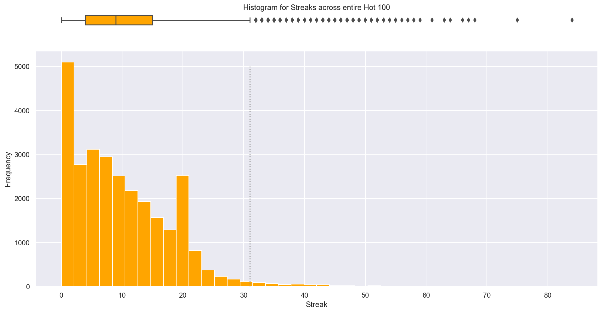

    Outliers in Streaks across the entire data set (Tukey's Fence k=1.5): >31

We can see a continuous fall as we're getting toward the higher streak lengths. One interesting peak can be observed at streak length 20. For some reason this bin is defying the downward trend.

We'll have a closer look at this distribution by year in the next plot.

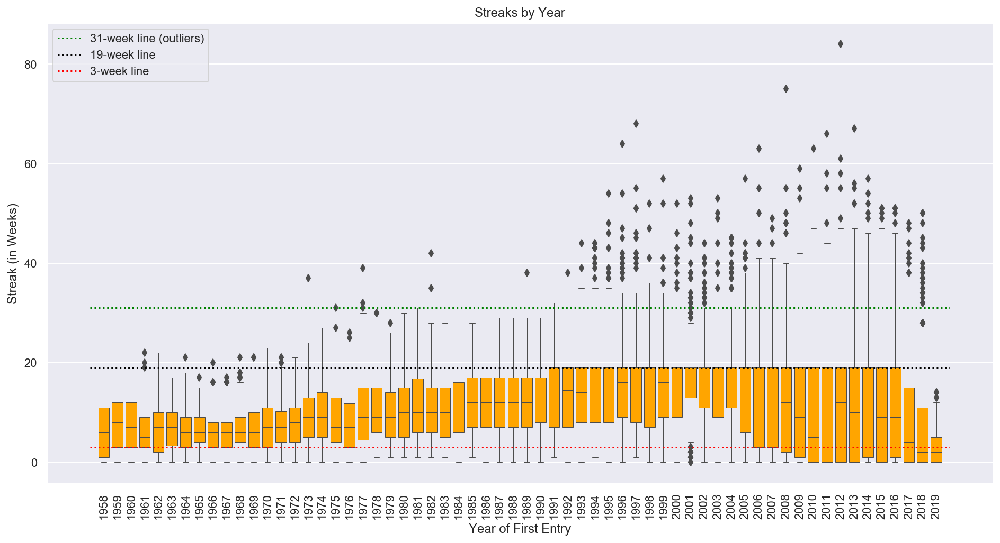

**19-week Pattern of lower 75% (third quartile)**

Between 1991 and 2016 the third quartile (i.e. upper quartile) is consistently at 19 streak weeks (i.e. 20 weeks on the Hot 100 due to the 0-indexing of the streak metric). There's no deviation from this pattern, no single year has a third quartile that surpasses this threshold. 

Looking into the underlying formula it looks like it has to do with a Hot 100 rule introduced in 1991 with the intend to speed up fluctuation ([20-20 rule](https://web.stanford.edu/~xhnguyen/BillboardandTechnology.pdf)). This rule specifies that a song that has fallen out of the top 20 will be removed after 20 weeks. The rule was relaxed in 1992 and 1993 to falling out of the top 40 and top 50 respectively.

The following plot highlights this effect distinctively by looking at exit positions of songs before 1991 and after 1991.

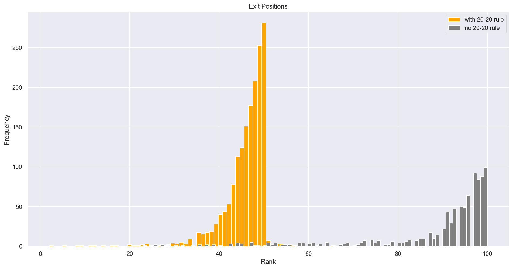 

    Number of songs whose streak was likely cut short: 1693

Above we can see the exit positions of songs with >19 weeks streaks before and after the 20-20 rule. It can be assumed that this rule has cut the streak of songs after 1991 short as we can see that generally songs would exit at the bottom of the Hot 100 (see _no 20-20 rule_) rather than dropping off suddenly.

#### Higher Fluctuation in Recent Years

Going back to the `Streaks by Year` plot. Starting in 2006 we can see that the first quartile (i.e. lower quartile) is stretching into the < 3 weeks region. A pattern we hadn't seen since the mid-1970s. This would indicate a higher fluctuation and is probably a result of Billboard slowly incorporating more and more online sales and streaming revenue into their formula since 2005 (https://en.m.wikipedia.org/wiki/Billboard_Hot_100 see _Digital downloads and online streaming_). 

#### Super Songs

Until the early 1970s no song title would be on the Hot 100 for more than 25 weeks and until the early 1990s staying charted for over 31 weeks (i.e. outliers across the entire data as shown in _Histogram of Streaks_ above) was the rare exception. In fact, there are only 6 artists who've achieved this feat (they are listed below).

There is a clear distinction in pattern between the charts after 1991 and previous periods. Interestingly, 1991 happens to be the year that the Hot 100 started to use Nielsen Soundscan, which gathered more precise music sales data (previously sales numbers were self-reported by stores). [Hot 100 Formula changes](https://en.wikipedia.org/wiki/Billboard_Hot_100) and [discussion](https://ndsmcobserver.com/2018/01/billboard-hot-100-controversy/)

    Number of Titles that stayed on the Hot 100 for more than 31 weeks 
    Before 1991 (33 years) - 6
    After 1991 (29 years) - 430

#### Before 1991

| artist             | title                 | streak | peak | entry | exit |
|--------------------|-----------------------|--------|------|-------|------|
| Soft Cell          | Tainted Love          | 42     | 8    | 90    | 97   |
| Paul Davis         | I Go Crazy            | 39     | 7    | 89    | 99   |
| Young M.C.         | Bust A Move           | 38     | 7    | 81    | 90   |
| Kris Kristofferson | Why Me                | 37     | 16   | 100   | 52   |
| Laura Branigan     | Gloria                | 35     | 2    | 84    | 98   |
| Bee Gees           | How Deep Is Your Love | 32     | 1    | 83    | 59   |

Go to Playlist: [https://open.spotify.com/user/1162788143/playlist/
0iP1Sz5qSCmVomZUNYbKPj?si=8SyDMByGRK60HNPHv9-HZA](https://open.spotify.com/user/1162788143/playlist/0iP1Sz5qSCmVomZUNYbKPj?si=8SyDMByGRK60HNPHv9-HZA)

---

#### After 1991 (Top 10 shown)

| artist           | title               | streak | peak | entry | exit |
|------------------|---------------------|--------|------|-------|------|
| Imagine Dragons  | Radioactive         | 84     | 3    | 93    | 49   |
| Jason Mraz       | I'm Yours           | 75     | 6    | 93    | 48   |
| LeAnn Rimes      | How Do I Live       | 68     | 2    | 89    | 45   |
| OneRepublic      | Counting Stars      | 67     | 2    | 32    | 50   |
| LMFAO Feat. ...  | Party Rock Anthem   | 66     | 1    | 78    | 49   |
| Jewel            | Foolish Games ...   | 64     | 2    | 61    | 47   |
| Adele            | Rolling In The Deep | 63     | 1    | 68    | 49   |
| Carrie Underwood | Before He Cheats    | 63     | 8    | 92    | 47   |
| The Lumineers    | Ho Hey              | 61     | 3    | 90    | 50   |
| Lady Antebellum  | Need You Now        | 59     | 2    | 85    | 48   |

Go to Playlist: [https://open.spotify.com/user/1162788143/playlist/
4hzjzSssha8VLHqwbyJiWA?si=xWT5wbXAR7OOeuyCrQKO-w](https://open.spotify.com/user/1162788143/playlist/4hzjzSssha8VLHqwbyJiWA?si=xWT5wbXAR7OOeuyCrQKO-w)

_NOTE: Unfortunately, there is 52 of the 430 songs missing from the playlist that couldn't be found on Spotify or are missing due to country restrictions._

50% of songs stayed on the Hot 100 for less than 10 weeks. The longest streak is 84 weeks and is held by 'Imagine Dragons' with 'Radioactive', a not so close runner-up is 'Jason Mraz' with 'I'm Yours' (75 weeks). 

Again we can see the effect of the 20-20 rule in the second song set's `exit` column - most songs exited on a position slightly before or at 50. While the the table before 1991 shows all songs (with the exception of one) exited closer to 100 than to 50.

Let's look at outliers for the streak variable (>31 weeks) by year to have a better look at their distribution.

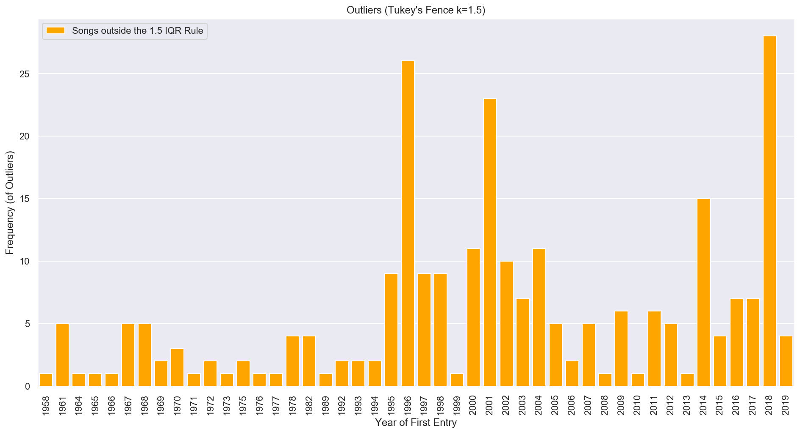

Starting in 1995 we can see a pattern of what I'm going to call _Super Songs_ emerge. Before 1995, there were only few songs that stayed long enough to be considered an outlier (Tukey's Fence rule). After 1993, however we can suddenly see these breakout songs occuring much more often. Standout years are 1996, 2001 and 2018 but other years are generating outliers more densely as well.

    Standard Deviations:
    <1991: 5.703656742368894
    >=1991: 10.154355499124337

This is despite (or due to?) a generally larger standard deviation in streaks on the Hot 100 after 1991. We can also see in the first streak plot that the outliers tend to stray further than outliers before 1991 (i.e. they stay longer on the Hot 100 or are 'stickier').

#### Is there a significant difference between the distribution of the Hot 100 before and after the introduction of Nielsen Soundscan data in 1991?

Throughout the above analysis, we've seen the year 1991 reappear over and over again as a turning-point. It is time to understand whether and how Nielsen Soundscan might've affected the Hot 100. 

Let's first have a look at the distributions before and after 1991.

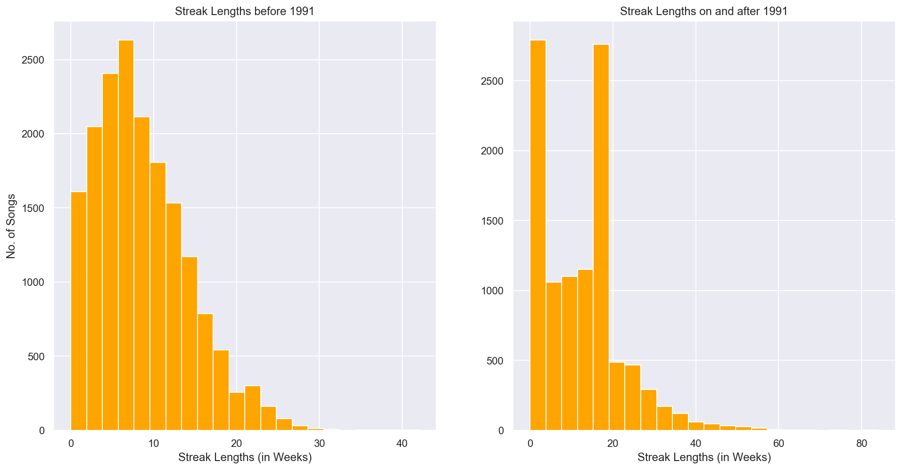

If the only change affecting the data was the 20-20 rule and the Nielsen Soundscan and other unknown factors had no effect on the streak length, we would expect roughly the same distribution for songs of 20 or less weeks on the Hot 100. However, we can see that the distribution of Hot 100 songs before and after 1991 are very different. The streaks length for songs after 1991 is far more left skewed than before. Most songs are in the lowest bin, only rivaled by the 19 streak weeks bin which, as seen in the [`Exit Positions`](#exit-positions) plot, was likely introduced by the 20-20 rule.

#### Test & Hypothesis

To see whether the change in distribution is statistically significant we're going to compare the mean of the distributions with a one-sided test. The assumption being that if the distributions of the population are equal beyond the 20-20 rule the mean of the distributions after 1991 should be lower than before 1991 as the 20-20 rule would prevent relatively more songs from going beyond 20 weeks on the Hot 100.

- **H0**: The mean streak length after 1991 is equal or lower than the mean streak length before 1991 (i.e. mean fluctuation stayed the same or increased). This would indicate that there is no indication the underlying distribution has changed.
- **H1**: The mean streak length after 1991 is larger than the mean streak length before 1991 (i.e. mean fluctuation decreased). This would support the argument that the underlying distribution has fundamentally changed and strengthen the case that the introduction of Nielsen Data, introduced data into the Hot 100 that led to an increase in streak lengths.
- **alpha**: 0.05

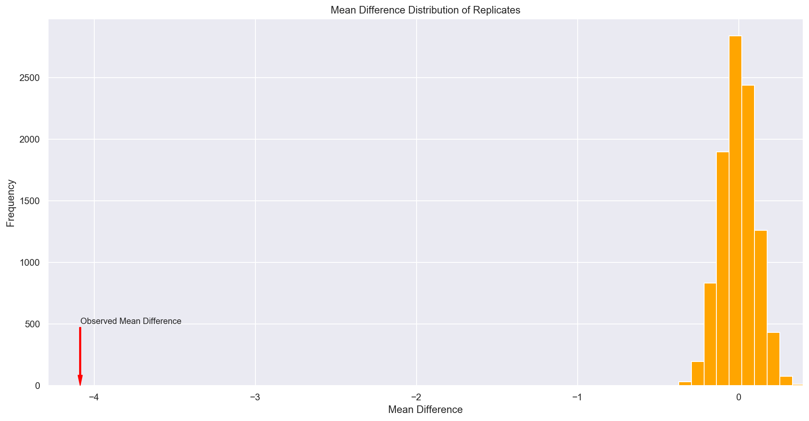

    p: 0.0

It is highly unlikely that the distributions are the same.  We can reject H0 for alpha > 0.001. Hence, there is an argument to be made that the introduction of Nielsen Data has had an effect on the distribution of the Hot 100. 

An argument could be made that without the introduction of the 20-20 rule along with the Nielsen Soundscan the Hot 100 could've become much staler than it has anyways. The 20-20 rule might've been introduced to offset the negative effect on fluctuation that was introduced by more accurate sales data.

### 4.1.2 The relationship of Peak Position and Streak Length

Looking at streak length it could be interesting to see whether there's a relationship with the peak position a song reached.

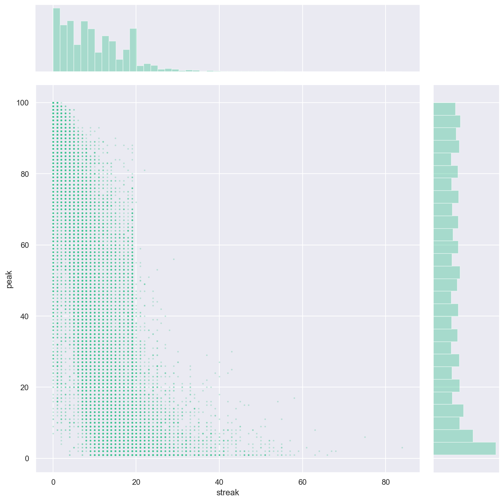

    Spearman's R: -0.7857196745443265 p-value: 0.0

We can see a roughly linear monotonic descending relationship (tested using Spearman's R) with a p value of 0. This means that there most likely is a relationship between streak lengths and peak position. The higher the peak position is the longer a song tends to stay on the Hot 100. We can see that this seems to be especially true for songs that make it onto the top 20. 

We had to use Spearman's R in this case as Pearson's R requires a normality assumption, which due to the discrete values of the 1-100 scale is not given.

_Quick Note: At Streak position 19 we can see an unusually bold line, this clearly demarcates the skewedness that the so-called "20-20 rule" (explained above) has introduced into the data._

#### Pole Position Streaks

Now we know that songs that have higher peak positions tend to stay on the Hot 100 longer but we've also seen that the pole position (i.e. rank 1) has the highest number of unique songs (see Histogram to the right side of the Joint plot above) indicating that this is a highly battled over position. Staying on the Hot 100 is one thing but I'm curious what songs were able to stay on the Hot 100's most coveted position the longest.

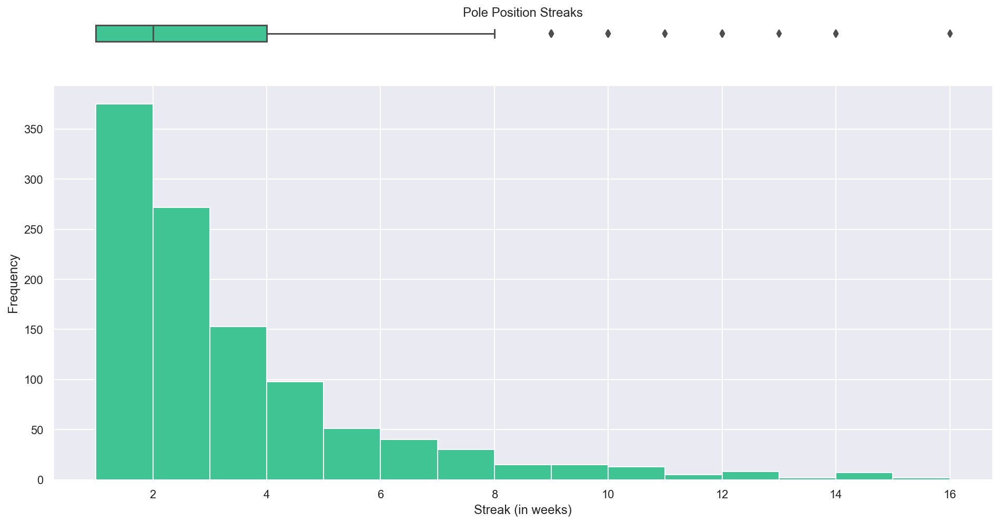

| artist                                            | title         | weeks |
|---------------------------------------------------|---------------|-------|
| Luis Fonsi & Daddy Yankee Featuring Justin Bieber | Despacito     | 16    |
| Mariah Carey & Boyz II Men                        | One Sweet Day | 16    |

    Total No.1 Hits: 1086

1086 songs made it to the top of the Hot 100 charts and less than 50% of those lasted more than 2 weeks on the pole position. Of those, only 2 songs were able to stay on the very top of the Hot 100 charts for 16 weeks (i.e. the longest streak).

### 4.1.3 Movements

Now that we've looked at peak positions and streaks, I'm interested to know how the jumps from one position (i.e. a leap) to another are distributed. Possibly we can uncover something interesting here as well.

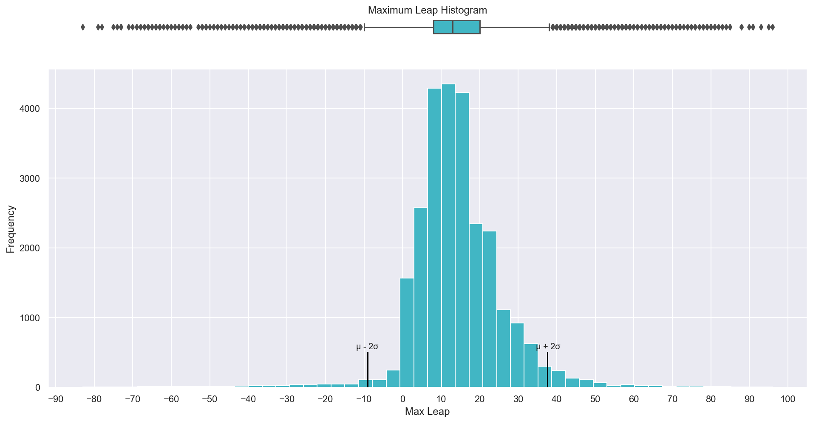

We see that the median maximum leap was just above 10 positions and that we can generally expect for most titles to leap at most between 7-19 places. We also can see that leaps beyond 38 positions are generally rare, so are negative maximum leaps beyond -9 (i.e. titles that consistently fell in position from their initial entry).

Generally, a title moves up at some point during their time on the Hot 100. This is obvious due to the shift of the distribution to values above 0.

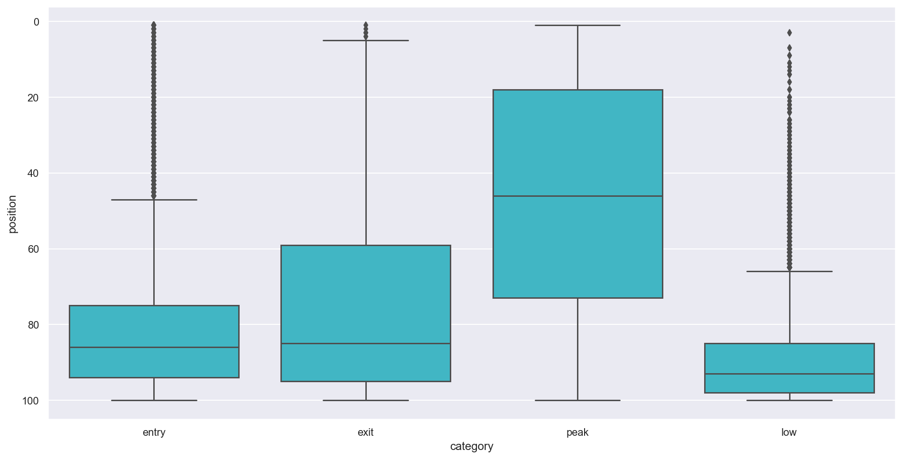

As seen at the beginning of the EDA. Generally songs enter and exit the Hot 100 in the lower positions. As expected it is hard to stay higher up on the Hot 100 and less than 50% of songs make it into the coveted Top 40.

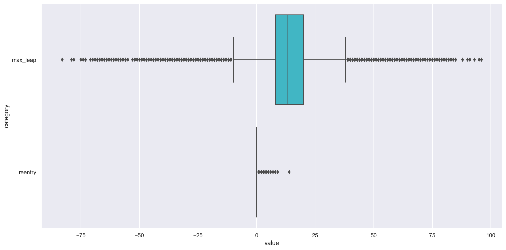

There are a total of 6 songs that were able to leap more than 90 positions from one week to another.

| artist              | title                          | streak | peak | max\_leap |
|---------------------|--------------------------------|--------|------|-----------|
| Dixie Chicks        | Not Ready To Make Nice         | 16     | 4    | 96.0      |
| Kelly Clarkson      | My Life Would Suck Without You | 23     | 1    | 96.0      |
| Britney Spears      | Womanizer                      | 22     | 1    | 95.0      |
| Lady Gaga           | Million Reasons                | 8      | 4    | 93.0      |
| LL Cool J Feat. ... | Control Myself                 | 7      | 4    | 91.0      |
| Beyonce & Shakira   | Beautiful Liar                 | 17     | 3    | 91.0      |

To understand the journey of these songs we'll make an attempt at visualizing it.

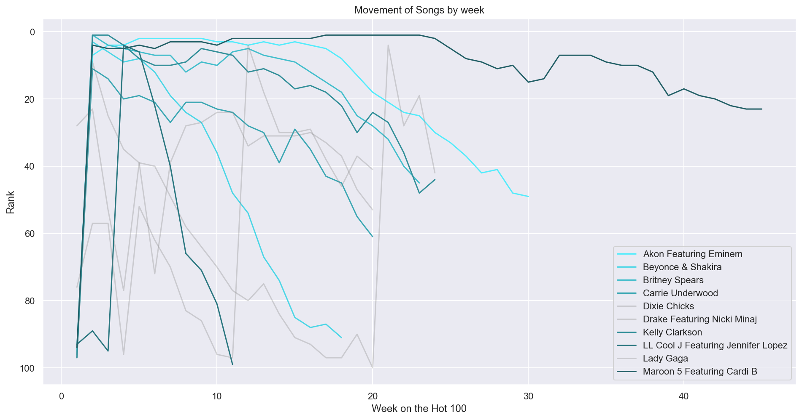

8 out of the 10 songs rise to their peak position within the first 4 weeks of their first appearance on the Hot 100. After the initial high is reached there tends to be more or less a steady decline for most of them. It looks like the peak position is reached very quickly after their respective maximum leap. Let's explore this thought further and see if this is the case for other songs as well. We'll be looking at the time to maximum leap and average distance to peak position.

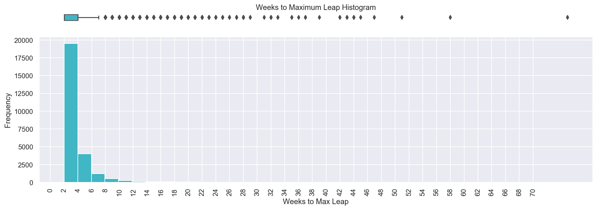

We can see that the highest jumps occur most often in the second to fourth week of songs making their debut on the Hot 100. Let's now examine whether this maximum leap is close to the final peak position.

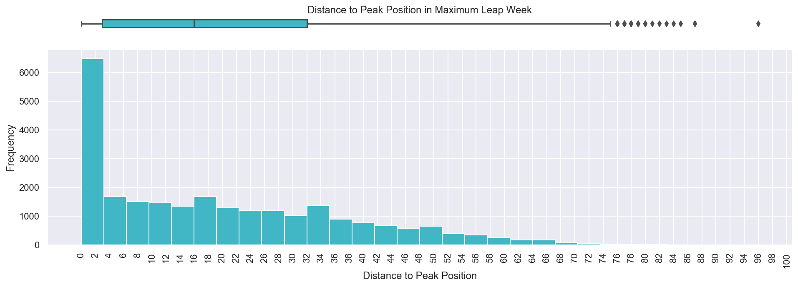

    Number of titles that reached their peak position in the 
    week of their maximum leap: 4375 (i.e. 15.58%)
    
              dist_peak          peak
    count  25273.000000  25273.000000
    mean      19.549559     43.111898
    std       17.725495     29.457823
    min        0.000000      1.000000
    25%        3.000000     16.000000
    50%       16.000000     41.000000
    75%       32.000000     68.000000
    max       96.000000    100.000000

4375 (i.e. 15.58%) immediately reach their peak position after their largest leap. The top 25% fall within 3 positions of their peak and the top 50% fall within 16 positions.

We can see that there is quite a large standard deviation of +-17.73 ranks from the mean of 19.54 ranks. While a large chunk of songs might be reaching a position close to their peak position, a lot of them don't.

### 4.1.4 Reentries

There's very few reentries. Most songs that leave the Hot 100 leave for good and only about 4% of the ones that do make a reappearance do so more than twice. In fact, only 6 songs have made a reappearance on the Hot 100 more than 5 times, and they are all seasonal Christmas Evergreens (with one exception 'Unchained Melody' by 'The Righteous Brothers' has made a comeback 14 times over a period of 26 years).

| artist                 | title                  | entry | exit | reentry | peak |
|------------------------|------------------------|-------|------|---------|------|
| The Righteous Brothers | Unchained Melody       | 1965  | 1991 | 14      | 4    |
| Brenda Lee             | Rockin' Around The ... | 1960  | 2019 | 9       | 9    |
| Bobby Helms            | Jingle Bell Rock       | 1958  | 2019 | 8       | 8    |
| Mariah Carey           | All I Want For Chr ... | 2000  | 2019 | 8       | 3    |
| Nat King Cole          | The Christmas Song ... | 1960  | 2019 | 7       | 11   |
| Bing Crosby            | White Christmas        | 1958  | 2019 | 6       | 12   |

### 4.1.5 Conclusion

The Hot 100 have gotten more stale through the years. We've seen less fluctuation of new unique songs being introduced to the Hot 100. More detailed sales data in the early 90s (Nielsen Soundscan) might've amplified that trend and was only held back by artificial streak length hurdles (20-20 rule). 

Since the 1970s unique songs per year had continually decreased, the change in that trend didn't come until the introduction of digital sales in the formula in 2005 and streaming data (i.e. Spotify, Youtube etc.). While it hasn't returned to its former quantity we've seen a small upwards trend in unique songs per year in recent years.

It was also argued that Nielsen Soundscan, with its addition of more granular data on song's actual sales data allowed the emergence of 'Super Songs', i.e. regular appearance of songs that stay on the Hot 100 for more than 31 weeks.

Looking at peak positions it became clear that there is a relationship between success in ranking and success in streak length.

Lastly, we've investigated movements of song through the Hot 100 and understanding whether there was a common pattern such as early rise to the peak position or correlation of big jumps to reaching a peak position.

## 4.2 Features of Hits and Non-Hits

After we've looked at the base on which our target variable is built, we're going to take a look at the elements used in this first iteration of the model.

To dive deeper into the actual make up of a song and see if we can build a model that can reliably identify songs on its content, we'll have a look at the audio features of a Hit. Let's start with a few descriptive metrics!

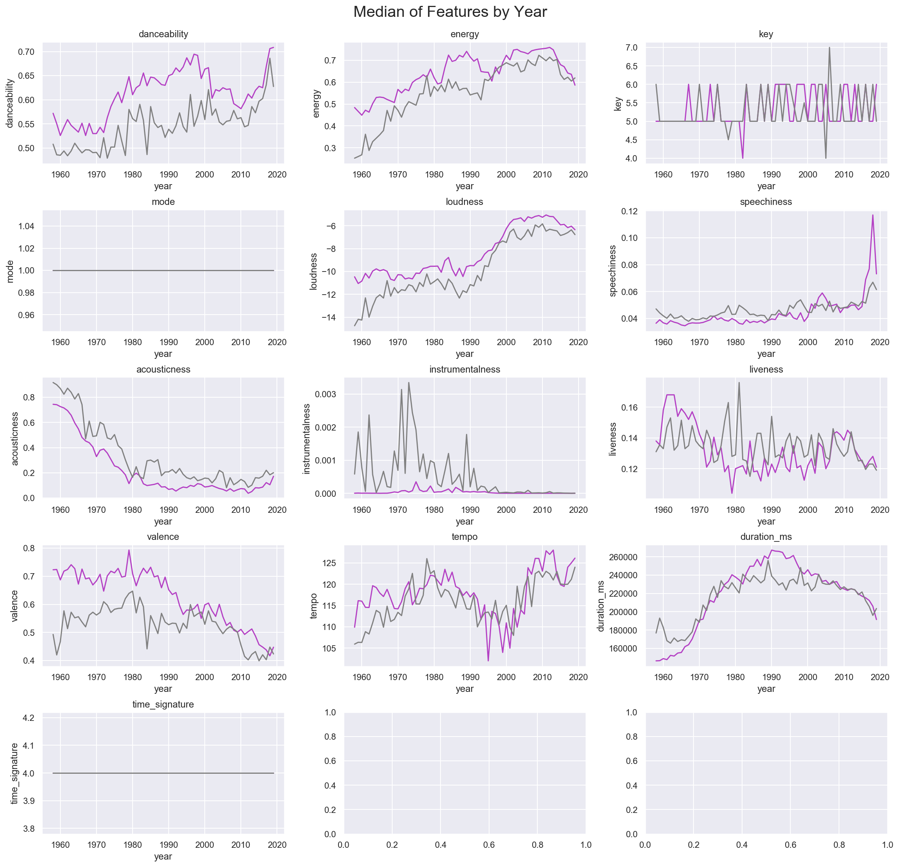

    There are 34671 rows and 20 columns

There are a few features that show some distinct trends when compared to Non-Hits. Median Danceability, Energy, Loudness and Valence of Hits are pretty consistently above their Non-Hit counterparts. While Acousticness has consistently a lower median across time. Instrumentalness and Speechiness show some interesting patterns that we should have a closer look at, too. Let's have a closer look at danceability first.

### 4.2.1 Danceability

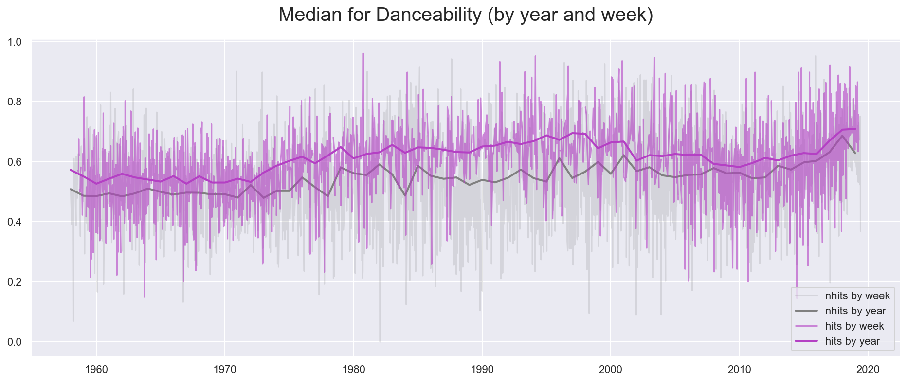

_"Danceability describes how suitable a track is for dancing based on a combination of musical elements including tempo, rhythm stability, beat strength, and overall regularity."_ [Spotify Track Features Description](https://developer.spotify.com/documentation/web-api/reference/tracks/get-audio-features/)

Simply looking at the amplitude of the two by day graphs, it's obvious that there is quite a bit of overlap between Hits and Non-Hits in terms of danceability. Nevertheless, Hits generally seem to be more danceable. We can see an upward trend starting in the mid 1970s with Non-Hits staying roughly the same (if introducing more variability). From the mid 1980s and late 1990s we can additionally see the amplitude between days visibly shrinking (i.e. less variability) suggesting that less danceable songs had a hard time getting onto the Hot 100 in this period. This is not a big surprise as the 1980s and 1990s are quite literally known for the emergence of dance and dance-pop. 

While the 1980s and 1990s were the age when danceability had the highest chance of thriving in the Hot 100, it should be said that the introduction of disco music in the 1970s has most likely played a role in clearing the way for this trend (i.e. see the uptick starting in the mid 1970s).

Starting in the early 2000s we're starting to see a minor slump in danceability, which lasted until the mid 2010s. Now in more recent years (likely pushed with the rise of Electronic Dance Music (EDM)), we're seeing the highest level of danceability in the Hot 100 Hits and quite low variability in 2018 and 2019. It's also notable that Non-Hits have been catching up in danceability and have closed in on the median danceability of the Hot 100 (disregarding the drop in 2019).

It can be seen that the trends mentioned above are also present in the Hit data, especially during the mid-1970s and mid-2000s there is a visible difference between Hits and Non-Hits (_see inference analysis below_).

Lastly, let's look at a few of the most danceable Hits throughout the history of the Hot 100.

| artist                  | title                             | date       | danceability | peak |
|-------------------------|-----------------------------------|------------|--------------|------|
| Tone-Loc                | Funky Cold Medina                 | 1989-06-03 | 0.988        | 3.0  |
| DJ Suede The Remix God  | Cash Me Outside (\#CashMeOutside) | 2017-03-04 | 0.981        | 72.0 |
| Glee Cast               | Ice Ice Baby                      | 2010-05-22 | 0.980        | 74.0 |
| The Jacksons            | State of Shock                    | 1984-09-22 | 0.980        | 3.0  |
| Vanilla Ice             | Ice Ice Baby                      | 1990-09-08 | 0.978        | 1.0  |
| Evelyn King             | Betcha She Don't Love You         | 1983-01-22 | 0.974        | 49.0 |
| Jermaine Jackson        | Let Me Tickle Your Fancy          | 1982-10-30 | 0.973        | 18.0 |
| 2nd II None             | Be True To Yourself               | 1992-01-11 | 0.971        | 78.0 |
| Cardi B Featuring Migos | Drip                              | 2018-06-02 | 0.968        | 21.0 |
| Justin Timberlake       | SexyBack                          | 2007-03-03 | 0.967        | 1.0  |

Judging from the Top 10 most danceable songs we can see the 1980s and early 1990s well represented. In more recent years, the most danceable songs that made it onto the Hot 100 with one exception (i.e. Justin Timberlake's SexyBack) had lesser success in terms of reaching a top position. That being said we see that the most recent dance Hit is _Drip_ from Summer 2018 and just fell short of making it onto the Top 20.

#### Inference Analysis of Danceability

In the following we're going to look at the statistical significance of the differences in distribution of Hits vs. Non-Hits.

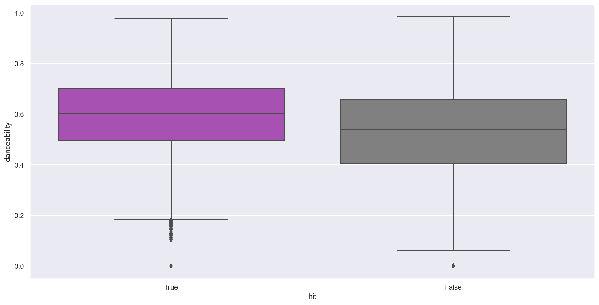

    Hits Mean: 0.5957135504885993
    Non-Hits Mean: 0.5295059136044526
    Mean Diff: 0.06620763688414666
    H0 Diff: 0

We can see some difference between the means of the two distributions but without a statistical significance test we can't be sure that this difference isn't simply due to chance of the sample and that the distributions are in fact the same.

To better understand whether the distributions are statistically significantly different we'll use a Z-Test.

**H0**: The Danceability Distribution for Hits and Non-Hits is the same (i.e. the mean diff is 0).

**H1**: The Danceability Distribution for Hits and Non-Hits is not the same.

**alpha**: 0.05

    p: 0.0
    CI: [-0.00384252  0.0037603 ]
    ME: 0.003786297754012112

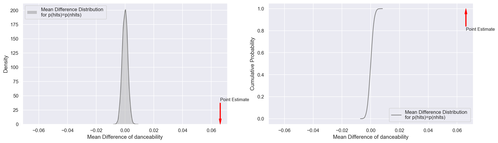

Looking at the test above it's clear that the observed mean difference is statistically significant. This is not surprising, due to the largeness of the sample but the exceptionally low p-value is positive evidence that we might be on the right track here and that there could be some predictive information in this feature. 

Given the results above, we can reject H0 and have gathered evidence to support H1. The data indicates that Hits tend to be more 'danceable'.

Some inferential tests are performed in the EDA but a summary of all relevant inferential tests performed on these features can be found in [Chapter 5](#5.-the-inferential-statistical-analysis).

### 4.2.2 Energy and Acousticness

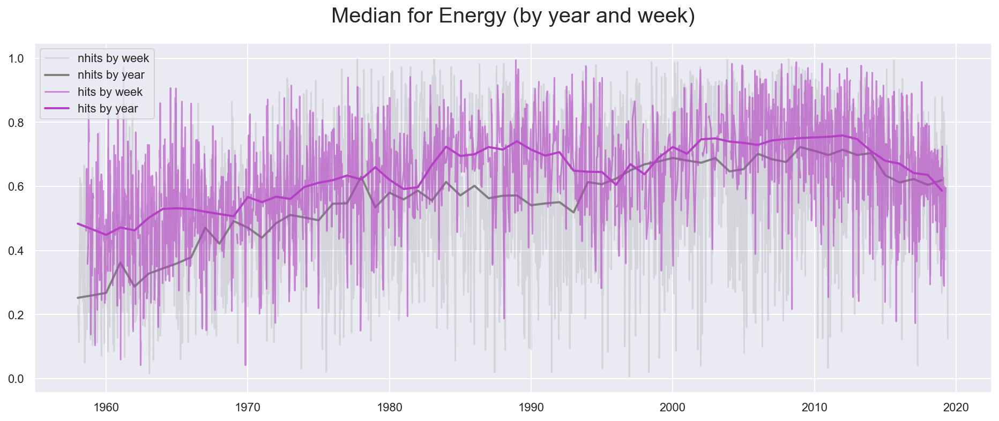

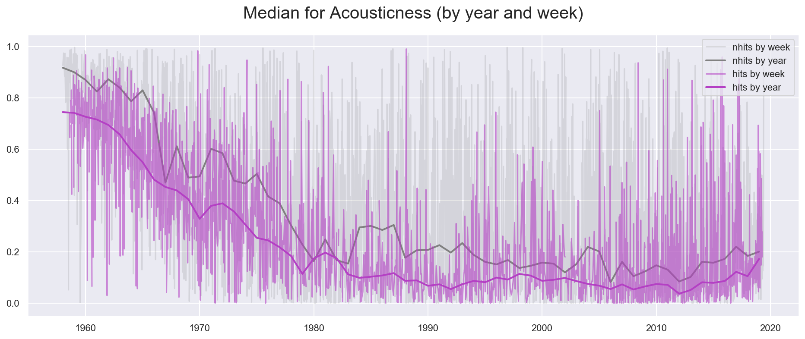

_"Energy [...] represents a perceptual measure of intensity and activity. Typically, energetic tracks feel fast, loud, and noisy."_  [Spotify Track Features Description](https://developer.spotify.com/documentation/web-api/reference/tracks/get-audio-features/)

Energy as a feature looks like a less clear-cut situation. First of all, there is a lot more overlap of Hits and Non-Hits. Furthermore, the median Energy levels by year have started to close in between Hits and Non-Hits in recent years. Nevertheless, starting in the early 1980s we're starting to see a stronger focus (lower variability) on high-energy songs compared to the early 1960s.

Again, just as with danceability we can see variability picking up in the mid- to late-2000s. Energy levels were at their all-time highs from the early 1980s until the 2010s (an exception were the mid- to late-1990s). We're clearly seeing similar movements to danceability. Starting in the early 2010s, however, we're seeing less energetic songs getting the upper hand. In fact, the Hot 100s median Energy levels have dropped below Non-Hits in 2019 for the third time since its inception.

For our model, we're witnessing again that higher energy levels seem to indicate a higher likelihood of Hit potential than low energy levels. Similarly this has been quite consistently the case starting in the mid-1970s to the mid-2010s.

To get a feeling for what songs are considered high energy, you can find a list of the top 10 most energetic songs below.

| artist               | title                   | date       | energy | peak |
|----------------------|-------------------------|------------|--------|------|
| Culture Beat         | Mr. Vain                | 1993-12-18 | 0.997  | 17.0 |
| Five Finger Deat ... | Under And Over It       | 2011-08-20 | 0.996  | 77.0 |
| Jane's Addiction     | Just Because            | 2003-08-09 | 0.996  | 72.0 |
| Guns N' Roses        | Nightrain               | 1989-08-26 | 0.995  | 93.0 |
| Suzi Quatro          | I've Never Been In Love | 1979-09-22 | 0.995  | 44.0 |
| The Chemical Bro ... | Setting Sun             | 1997-02-15 | 0.995  | 80.0 |
| Bananarama           | Love, Truth & Honesty   | 1988-12-03 | 0.994  | 89.0 |
| Go-Go's              | We Got The Beat         | 1982-05-15 | 0.994  | 2.0  |
| Jimmy Ruffin         | Hold On To My Love      | 1980-04-12 | 0.994  | 10.0 |
| Metallica            | Cyanide                 | 2008-09-20 | 0.993  | 50.0 |

_"[Acousticness is] a confidence measure from 0.0 to 1.0 of whether the track is acoustic."_  [Spotify Track Features Description](https://developer.spotify.com/documentation/web-api/reference/tracks/get-audio-features/)

As a comparison I've plotted the development of acousticness confidence below the energy plot. We can see that acousticness confidence and variability decrease in the late 1970s and are on historic lows in the 1980s throughout the 1990s and until the mid 2000s (with a few exceptions). 

Energy and Acousticness are not necessarily opposite sides of the same relationship but sharing a drastic change from their original influence on Hits they might be. Energy on one end has enjoyed a meteoric rise in the 1980s, acousticness has dropped drastically in the 1980s, variability and median in acousticness have recently picked back up while energy has started to drop in recent years. The 1970s and 1980s seems to be a turn away from quaint acoustic music toward music that is more forward. Unfortunately, our analysis of the negative relationship between these two features is limited as Spotify does not release a detailed break-down of their features.

My assumption is that the visible drop in Acousticness in the mid 1970s is marking the introduction of synthesizers and meteoric rise of more electronically infused music in subsequent decades.

In both cases we seem to be looking at one or several bigger trends as Hits and Non-Hits are moving in the same direction but with Hits having fewer variability it looks like these two features could carry a lot of explanatory information especially for the period between 1980s and 2000s.

 | artist               | title                 | date       | acousticness | peak | 
 |----------------------|-----------------------|------------|--------------|------| 
 | Ferrante & Teicher   | Exodus                | 1961-02-20 | 0.991        | 2.0  | 
 | Wa Wa Nee            | Stimulation           | 1988-02-06 | 0.990        | 86.0 | 
 | Mr. Acker Bilk       | Stranger On The Shore | 1962-05-26 | 0.988        | 1.0  | 
 | Domenico Modugno     | Nel Blu Dipinto ...   | 1958-11-03 | 0.987        | 1.0  | 
 | Hank Ballard And ... | Nothing But Good      | 1961-09-04 | 0.987        | 49.0 | 
 | Jeanne Black         | Oh, How I Miss Yo ... | 1960-12-26 | 0.987        | 63.0 | 
 | Justin Bieber        | Nothing Like Us       | 2013-02-23 | 0.987        | 59.0 | 
 | The Shirelles        | Thank You Baby        | 1964-07-25 | 0.987        | 63.0 | 
 | 4 Non Blondes        | What's Up             | 1993-07-31 | 0.986        | 14.0 | 
 | Tal Bachman          | She's So High         | 1999-07-03 | 0.985        | 14.0 | 

The only song since the turn of the century that is among the highest acousticness that made it onto the Hot 100 is Justin Bieber's Nothing Like Us. 

### 4.2.3 Loudness

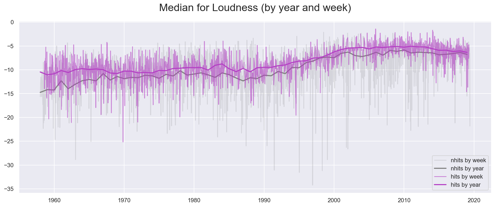

_"The overall loudness of a track in decibels (dB). Loudness values are averaged across the entire track and are useful for comparing relative loudness of tracks."_  [Spotify Track Features Description](https://developer.spotify.com/documentation/web-api/reference/tracks/get-audio-features/)

As a feature, loudness is very consistently flat before the 1990s and then again starting in the early 2000s (i.e. at a higher level). We can clearly see that in the 1990s something in music changed, more and more songs were created that had a relatively higher loudness.

In general, we see that Hits are having a higher median loudness but especially in the last few years we're seeing that Hits and Non-Hits loudness do not diverge much anymore. This would indicate that music has generally become louder.

| artist                 | title                 | date       | loudness | peak |
|------------------------|-----------------------|------------|----------|------|
| Lana Cantrell          | Like A Sunday Morning | 1975-03-01 | 2.291    | 63.0 |
| Diplo, French Mont ... | Welcome To The Party  | 2018-06-02 | 0.175    | 78.0 |
| Metallica              | Cyanide               | 2008-09-20 | -0.463   | 50.0 |
| Diana Ross & The S ... | Some Things You Ne... | 1968-06-08 | -0.507   | 30.0 |
| Eminem                 | Cold Wind Blows       | 2010-07-10 | -0.517   | 71.0 |
| Luke Bryan             | Move                  | 2016-12-10 | -0.698   | 50.0 |
| Diana Ross & The S ... | Love Child            | 1968-11-23 | -0.810   | 1.0  | 
| Eminem                 | Insane                | 2009-06-06 | -0.883   | 85.0 |
| Barenaked Ladies       | Too Little Too Late   | 2001-04-28 | -0.884   | 86.0 |
| Eminem                 | 25 To Life            | 2010-07-10 | -0.945   | 92.0 |

I believe especially Lana Cantrell's Like A Sunday Morning is a good example of an older song that falls into the loud category, while Cold Wind Blow by Eminem might be a good example for a newer song. _see examples above_

### 4.2.4 Speechiness

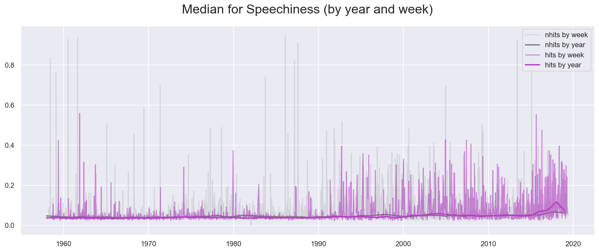

_"Speechiness detects the presence of spoken words in a track. The more exclusively speech-like the recording (e.g. talk show, audio book, poetry), the closer to 1.0 the attribute value. Values above 0.66 describe tracks that are probably made entirely of spoken words."_  [Spotify Track Features Description](https://developer.spotify.com/documentation/web-api/reference/tracks/get-audio-features/)

For Speechiness we can see an upward trend starting in the 1990s, with an increased density of high speechiness weeks and generally more high points, often going past 0.2 median (a rarety before 1990 but a common occurrance afterwards).

It's hard to pin-point what Speechiness is actually measuring as we're looking at the songs with the highest Speechiness. I would've assumed that the highest Speechiness would be found in Rap songs but judging from it there is a good mix of Country, Pop and Hip Hop music. This feature doesn't seem to be all that helpful for our analysis for now. There is no clear indicators and the feature itself is quite obtuse. With a lack of additional information of how this feature is put together, I've decided to abandon the feature for now.

| artist               | title                      | date       | speechiness | peak |
| -------------------- | -------------------------- | ---------- | ----------- | ---- |
| Chris Young Duet ... | Think Of You               | 2016-05-14 | 0.951       | 40.0 |
| Wu-Tang Clan         | C.R.E.A.M. (Cash Rules ... | 1994-04-09 | 0.950       | 60.0 |
| Taylor Swift         | Should've Said No          | 2008-06-21 | 0.941       | 33.0 |
| Hudson and Landry    | Ajax Airlines              | 1972-01-22 | 0.924       | 68.0 |
| Reba McEntire        | I'll Be                    | 2000-07-01 | 0.924       | 51.0 |
| Stan Freberg         | The Old Payola Roll Bl...  | 1960-02-29 | 0.919       | 99.0 |
| Hudson and Landry    | Ajax Liquor Store          | 1971-07-03 | 0.913       | 43.0 |
| Cheech & Chong       | Sister Mary Elephant ...   | 1974-01-12 | 0.882       | 24.0 |
| Steve Martin         | Grandmother's Song         | 1977-12-10 | 0.858       | 72.0 |
| Dickie Goodman       | The Touchables In Brooklyn | 1961-05-29 | 0.847       | 42.0 |

### 4.2.5 Valence

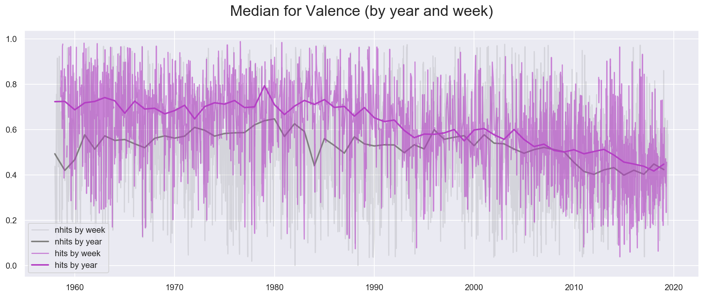

_A measure from 0.0 to 1.0 describing the musical positiveness conveyed by a track. Tracks with high valence sound more positive (e.g. happy, cheerful, euphoric), while tracks with low valence sound more negative (e.g. sad, depressed, angry)._ [Spotify Track Features Description](https://developer.spotify.com/documentation/web-api/reference/tracks/get-audio-features/)

Valence is quite an interesting indicator as it attempts to measure positivity of music. In turn, we can see that the Hot 100 were generally more positive than Non-Hits all the way through the mid-1990s until Hits drop down in valence in 1995 and then slowly continue to decrease to its current low-point having almost now visible difference between Hits and Non-Hits.

Knowing that Valence has more and more decreased it might be interesting to see the songs with the highest and lowest valence.

| artist          | title                  | date       | valence | peak |
|-----------------|------------------------|------------|---------|------|
| Eddie Hodges    | I'm Gonna Knock On ... | 1961-07-10 | 0.991   | 12.0 |
| Four Tops       | It's The Same Old Song | 1965-08-21 | 0.991   | 5.0  |
| War             | Low Rider              | 1975-10-25 | 0.990   | 7.0  |
| Katrina And ... | Que Te Quiero          | 1985-11-09 | 0.989   | 71.0 |
| John Sebastian  | Hideaway               | 1976-07-31 | 0.988   | 95.0 |

---

| artist                  | title               | date       | valence | peak |
|-------------------------|---------------------|------------|---------|------|
| Georgie Young           | Nine More Miles ... | 1958-11-03 | 0.0000  | 58.0 |
| Coldplay                | Midnight            | 2014-05-10 | 0.0349  | 29.0 |
| A$AP Rocky              | L$D                 | 2015-06-13 | 0.0352  | 62.0 |
| The Pipes And Drums ... | Amazing Grace       | 1972-07-01 | 0.0359  | 11.0 |
| Drake                   | Jaded               | 2018-07-21 | 0.0371  | 32.0 |

The highest valence songs are between 1961 and 1985, the lowest valence songs are a little more spread out but it's striking that 3 of the top 5 lowest valence songs were released in the 2010s. That being said Georgie Young might also just be an outlier and mislabeled as it happened to be the only song with 0.0 Valence and it being quite a bit apart from the other lowest valence songs.

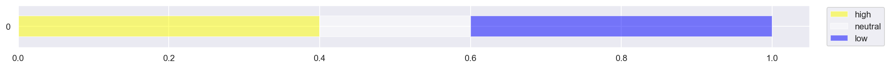

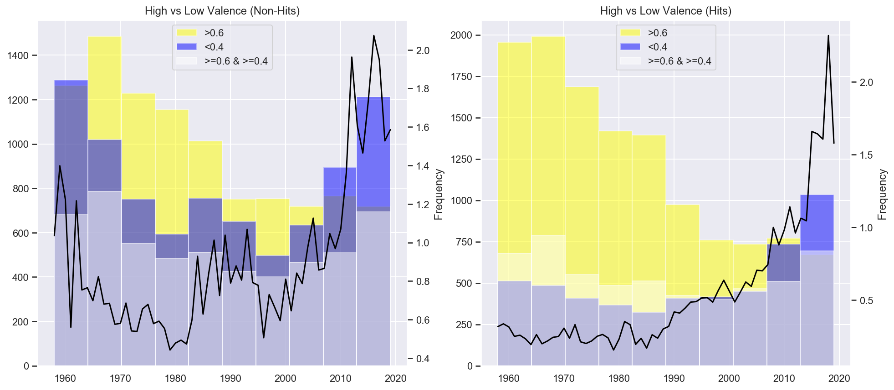

_NOTE: To avoid using an arbitrary cut-off point such as 0.5, I've introduced a neutral category for valence levels between 0.4 - 0.6._

While there is also a higher percentage of low valence music among Non-Hits the distinction between High-Valence and Low-Valence songs in the Hot 100 is a stark contrast if looked at across time. The number of low-valence songs in the Hot 100 before 2010 is consistently low while the high valence songs are dropping at a more or less linear-looking rate starting in the 1970s all the way through the 2000s. In the 2010s, low-valence songs are catching up with high-valence songs for the first time and in the 2020s low-valence surge beyond high-valence songs. Today, both Non-Hits and Hits are at an all-time high for low-valence songs.

The graphs show that we're increasingly listening to less positive sounding music in our Hot 100 charts as well as in our popular music in general.

### 4.2.6 Instrumentalness

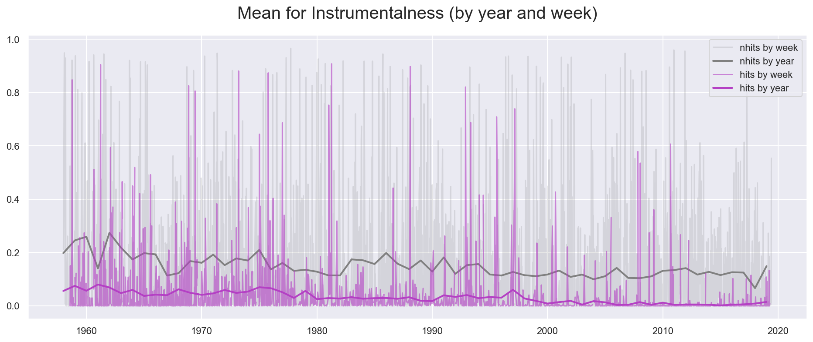

_Instrumentalness predicts whether a track contains no vocals. [...] The closer the instrumentalness value is to 1.0, the greater likelihood the track contains no vocal content._  [Spotify Track Features Description](https://developer.spotify.com/documentation/web-api/reference/tracks/get-audio-features/)

Instrumentalness basically detects the vocal to instruments ratio. Rap songs are closer to 0 while classical music can be found at values > 0.5. It is an interesting feature due to the fact that the Hot 100 are strongly partial toward non-instrumental songs. This makes sense, especially in recent times, with the rise of Rap music but interestingly we can observe in the chart above that there has been a strong bias toward less instrumentalness in songs throughout the entire history of the Hot 100. 

 | artist                | title             | date       | instrumentalness | peak | 
 |-----------------------|-------------------|------------|------------------|------| 
 | Darude                | Sandstorm         | 2001-09-22 | 0.982            | 83.0 | 
 | Henry Mancini And ... | Charade           | 1964-02-15 | 0.982            | 36.0 | 
 | Ray Ellis And ...     | La Dolce Vita ... | 1961-07-10 | 0.979            | 81.0 | 
 | Frank Mills           | Love Me, Love ... | 1972-03-18 | 0.966            | 46.0 | 
 | Larry Carlton         | Sleepwalk         | 1982-02-27 | 0.966            | 74.0 | 
 | B. Bumble & The S ... | Nut Rocker        | 1962-04-07 | 0.965            | 23.0 | 
 | Enya                  | Caribbean Blue    | 1992-03-14 | 0.965            | 79.0 | 
 | Chantay's             | Pipeline          | 1963-05-04 | 0.964            | 4.0  | 
 | Billy Vaughn And ...  | Wheels            | 1961-02-20 | 0.963            | 28.0 | 
 | Herb Alpert & The ... | 3rd Man Theme     | 1965-10-02 | 0.962            | 47.0 | 

 As expected we see most of the instrumental songs in the 1960s. Insterestingly, the song at the top came out at the beginning of the Century in 2001 `Sandstorm` by `Darude`. Since it is an EDM track, it's also a good example for a song that is not acoustic and yet categorized as instrumental.

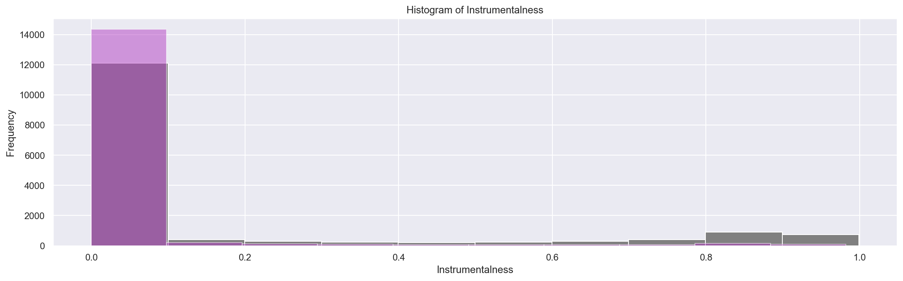

Another reason that makes this potentially interesting for Hit detection is the fact that there are significant amounts of Non-Hits that fall into the instrumental category.

To better understand whether the distributions are statistically significantly different we'll use a Z-Test.

- **H0**: The Instrumentalness Distribution for Hits and Non-Hits is the same (i.e. the mean diff is 0).
- **H1**: The Instrumentalness Distribution for Hits and Non-Hits is not the same.
- **alpha** = 0.05

    Hits Mean: 0.03421712542280131
    Non-Hits Mean: 0.15391891948833092
    Mean Diff: -0.11970179406552961
    H0 Diff: 0
    p: 0.0
    CI: [-0.00534099  0.00530983]
    ME: 0.0053006576330059795

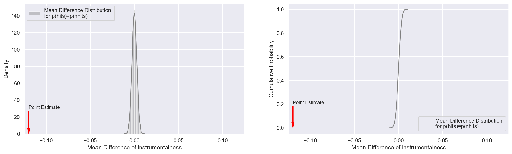

The p-value for the Point Estimate occuring if Hits and Non-Hits were equally distributed is <0.05 and we can therefore reject H0 and accept H1. The distributions are significantly different for p<0.001. Hence, we can consider using this feature in our model.

### 4.2.7 Duration (in ms)

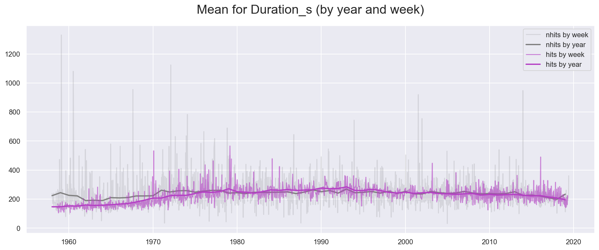

_The duration of the track in milliseconds._ [Spotify Track Features Description](https://developer.spotify.com/documentation/web-api/reference/tracks/get-audio-features/)

The duration of a track could be a good feature since the Hot 100 are looking at airplay on radios which have historically favored songs that have a specific length. To get a more intuitive sense the data has been downsampled to seconds. We can see that songs that made it onto the Hot 100 were generally not longer than 3 minutes but starting in the 1970s the average length of a track has gotten slightly longer (i.e. around the 4-minute mark), indicating a new standard for slightly longer tracks. 

We can see that Non-Hits while also having scaled down slightly, closer to the 4-minute mark, there is still a lot of songs that are significantly longer or shorter than the Hit songs.

### 4.2.8 Discrete Variables

It's clear that `time_signature`, `key` and `mode` don't hold much value for us using the median as a summary statistic. Hence, we're going to look at them in a countplot.

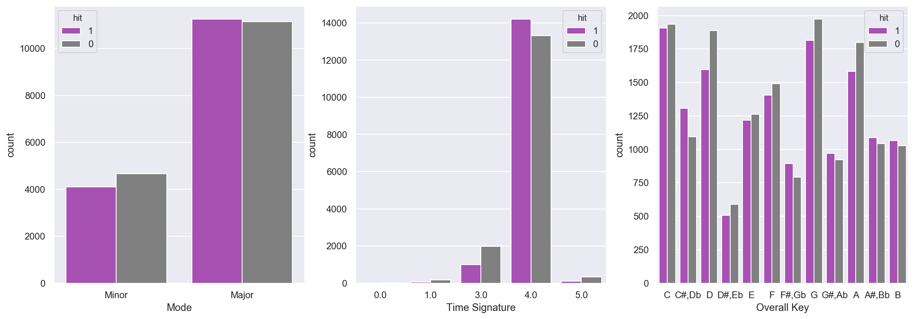

We can see general tendencies:
    - More than 2/3 of songs are written in Major
    - Most songs are written predominantly with a 4 time signature
    - Full keys (e.g. C,D,E or F) are relatively more popular than keys using semitones (e.g. C#,D# or F#)

Beyond that unfortunately it doesn't look like we can make out any major differences between Hits and Non-Hits using these features. While these differences might still be statistically significant we'll have to check whether they hold enough predictive information to be used in a model.

### 4.2.9 Conclusion

We've seen that multiple features (e.g. Danceability, Energy, Loudness, Instrumentalness and Valence) reflect historic music trends quite well and that the Hits of the time represent quite interesting subsets within the Non-Hits spectrums. Overlap is expected, after all, Hits are not likely to become Hits solely due to their intrinsic features. It also would make sense that Hit songs are representing a more or less distinct subset as they are popular music which indicates a mainstream appeal and a certain general likeability. Hence, they are more streamlined and more prone to follow trends. We can see this especially during the 1990s and 2000s. Most of the features are narrowing into subsections of the entire spectrum of available popular music.

We were also able to make out distinct trends for certain time periods (e.g. before 1980s, between 1990s and 2000s or after the 2000s).

There's certainly plenty of opportunity to further investigate these features. In a future iteration, I'm contemplating investigating a few additional questions:
- Is there any dominance of genre during certain periods?
- What is the influence of artists on features and time periods?

But for now we're going to conclude our Exploratory Data Analysis and narrow in on our feature selection.

-------------------------------------------------

# 5. The Inferential Statistical Analysis

The section on inferential statistics is looking at statistical significance on observations made and thoughts had during the EDA. This is an essential step to understanding whether or not the differences between Hits and Non-Hits are unlikely to have just happened by chance.

The focus for us lies on three categories:
- Distribution between Hits and Non-Hits
- Correlation with the Target Variable (i.e. Hit or Non-Hit)
- Collinearity between Features

## 5.1 Challenges

#### Normality

One of the biggest challenges for this project was the lack of available normally distributed data (see Q-Q plots below). Normally distributed data is often a requirement for classical statistic tests. Luckily, the Central Limit Theorem is helping us to use the Z-Test to compare distribution differences anyways.

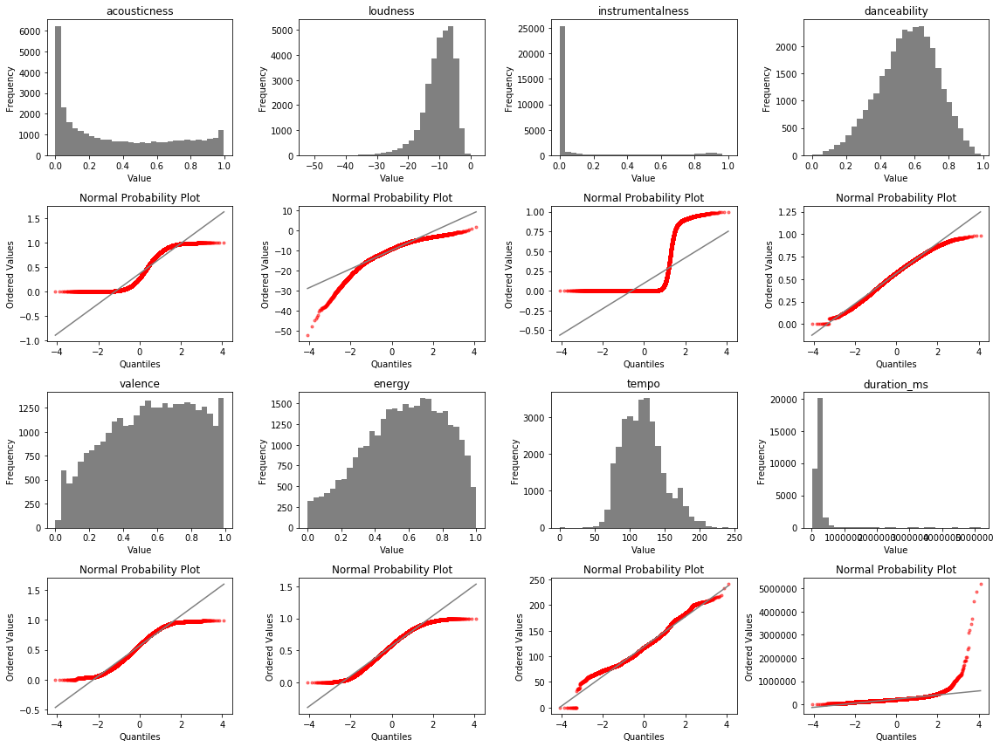

#### Statistical and Practical Significance

Due to the large sample sizes even the slightest differences can be considered statistically significant but might not actually allow us to use a feature for our model as their predictive qualities are limited. As in many other cases we need to rely on a combination of staistical test and also sound reasoning for model building.

#### Preprocessed Features

As we're relying on features that are preprocessed and aggregated by Spotify we're looking at features that are obtuse and abstract features. While this allows for intuitive assumptions as they were created in categories that seem familiar, we're actually losing some of the interpretability as Spotify doesn't allow us to fully understand how these features come together.

## 5.2 Features Tested

We have two different categories of features:
- Continuous Features (e.g danceability, instrumentalness etc.)
- Discrete Features (e.g. time signature, key etc.)

#### Continuous Features

In many ways Hit prediction is about finding the subtle differences and similarities between Hits and Non-Hits, continuous features tend to be much more valuable in uncovering those differences and trends across time which is why the first part of the inferential statistics tests were focused on those features. 

#### Distributions

To understand whether the differences between Hits and Non-Hits observed are significant, I've conducted Z-tests for distributions on the following features (only continuous variables included):
- acousticness
- loudness
- instrumentalness
- danceability
- valence
- energy
- tempo
- duration_ms

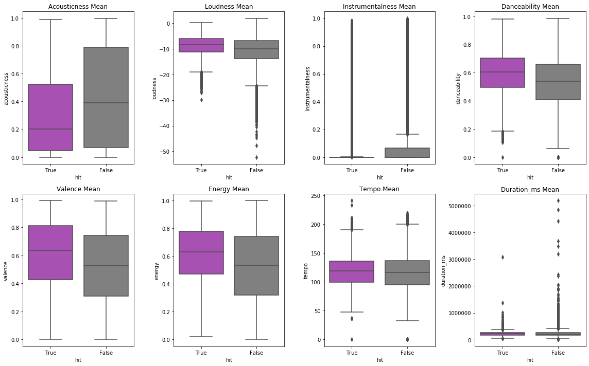

The method was to compare mean differences across 10000 permutations and then check whether the mean difference of the observed distributions would fall into the realm of significant possibilities. 

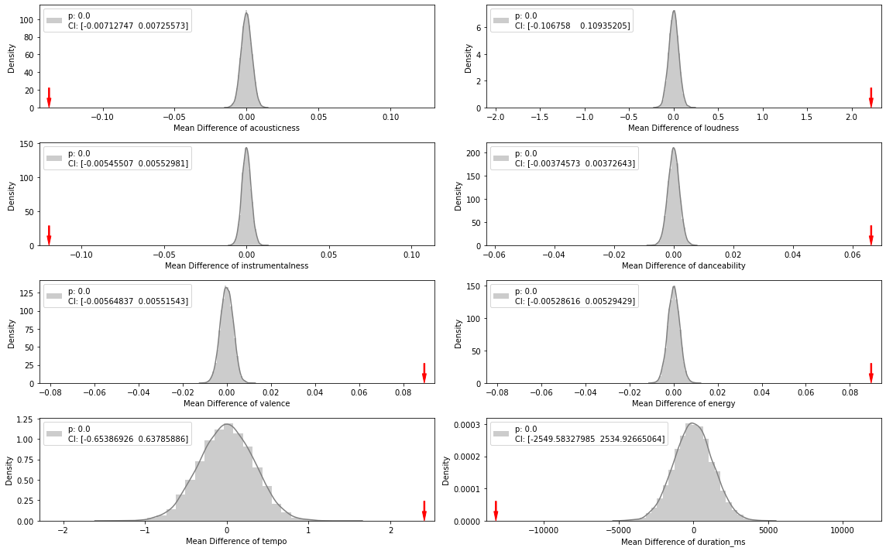 

For all features above, the probability (p-value) was \<0.001, allowing me to reject the null hypothesis (H0) that Hits and Non-Hits were equally distributed for the respective feature. In the next step we're going to look at the correlation of these features with each other and with the target variable.

_I want to recognize that we're conducting a multitude of Z-tests which increases the likelihood of a Type 1 Error. Unfortunately, I'm unable to use ANOVA or Chi-squared as we're using continuous data to predict a binary target. ANOVA would be helpful if we had a multitude of categorical data and a continuous target variable while Chi-squared allows to compare categorical data._

#### Correlation

As pointed out above exploring relationships between continous variables with binary outcomes comes with a few challenges especially when we're attempting to use popular statistical tools (Pearson's R, ANOVA etc.). Due to this issue for this project we've used logistic regression instead. 

_Sidenote: Using Pearson's R would've yielded dubious results at best - try drawing a linear regression line through a binary outcome and you'll understand why Pearson's R won't be a suitable tool_

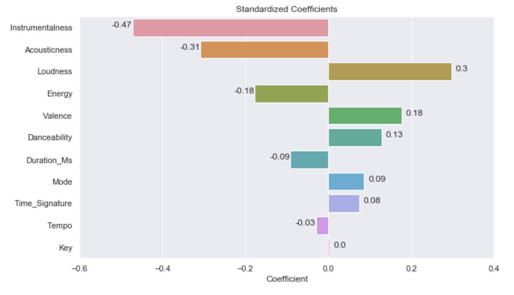

Using Logistic Regression's Beta based on standardized values allowed us to evaluate the relative importance of the features used. We can see at the top are three features to detect Hits:
- Instrumentalness
- Acousticness
- Loudness

At the bottom we can see two features:
- Tempo
- Key

Interestingly, Tempo seems to have very little influence on whether the song can become a Hit or not. It might be interesting to see, if Tempo would perform better if the model was taking time/year into account but as this is prone to overfitting the data this exploration will have to be done in a different project/iteration. The Key feature expectedly scores low in weight, no surprise there.

We can also see that 
- Mode 
- Time Signature 

are performing better than expected. However, as we've evaluated in the EDA Mode and Time Signature features aren't convincing features, these could quickly change and might overfit our model rather than leading to actual higher accuracy.

Hence, we'll drop Tempo, Mode, Key and Time Signature from our feature list.

#### Collinearity

For collinearity measurements we've used the popular Pearson correlation coefficient (i.e. Pearson's r). Even though this couldn't be used for describing relationships between continuous predictor and a discrete target variable, it's a good metric to detect collinearity between predictors. A characteristic of multiple features standing in relation to each other is an issue because our assumption is that each feature is an _independent_ variable. Correlation, however implies that with a change in one variable it affects another making the relationship with the target variable increasingly murky. This has drastic implications for the stability of our model which can be read about in further detail [_here_](https://statisticsbyjim.com/regression/multicollinearity-in-regression-analysis/). 

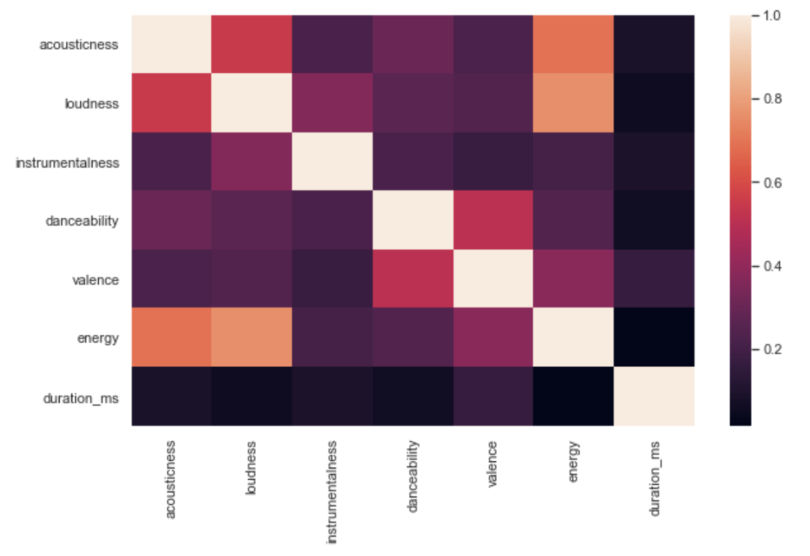

I've found strong correlation between `energy` and `acousticness` (0.7) as well as `energy` and `loudness` (0.76). Somewhat correlated are `acousticness` and `loudness` (0.55) as well as `valence` and `danceability` (0.51). All four correlations were statistically significant for p<0.001 but as the correlations were only moderately strong for some features and removing them might've removed some actual information about a song's content, I decided to use dimension reduction via Pricincipal Component Analysis (PCA) instead.

#### Conclusion

In conclusion, we'll be using a combination of the features below to describe a song's content and make inferences about its ability to make it onto the Hot 100. 

- Acousticness
- Loudness
- Instrumentalness
- Danceability
- Valence
- Energy
- Duration_ms

To take care of collinearity issues we're using dimensionality reduction (in our case via PCA).

In the Machine Learning section we'll be looking at multiple different ML algorithms, Cross Validation and Performance metrics to optimize the predictive qualities of our model.

# 6. The Model

In this step we're going to prepare the features, create a model and test it for performance.

To make sure we're not overfitting and are able to detect the generalizability of our model's performance we've divided our data into a hold-out dataset and tuning dataset in the beginning of our project.

## 6.1 Dimensionality Reduction (PCA)

As shown in the inferential statistics section, there are a few features that show correlations with each other that weren't immediately removed as this could've led to loss of valuable information. Dimensionality Reduction allows us to distill these features to their intrinsic dimensions. This is certainly not a cure-all method but can help dealing with situations in which we believe a feature has relevance to some extent but shows collinearity as in our case.

For this project we're using one of the most popular methods called Principal Component Analysis (PCA). One pretty significant catch of this method is that due to the transformations performed we're losing the interpretability of the model. This is quite significant for a lot of use-cases as that allows us to learn directly from models. In a future iteration I might consider removing the Dimensionality Reduction to improve understandability.

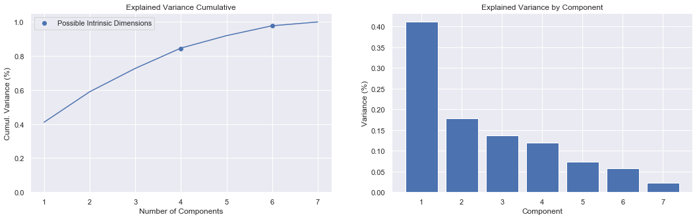

The above graphic shows the cumulative explained variance ratio and explained variance by component. It's not an easy decision as it looks like the largest chunk of information rests in just one component. The two other cut-off points are 4 and 6. To do our best to avoid overfitting we're using just 4 components.

## 6.2 Optimization of Hyperparameters 

In this step we're now splitting our tuning dataset again into train and test data. This allows us to find the best parameter for our training set and validate the Hyperparameter performance using the test set without touching the hold-out set and possibly contaminating our setup.

Using the training data and test data, algorithms and evaluation metrics we'll be applying Cross-Validation to find the optimal hyperparameters.

#### Algorithms

For Machine Learning Algorithms we're using two very common algorithms that generally show a good performance as stand-alone setups. 

**k-Nearest Neighbor** is highly resource intensive as it calculates the distance to each point and then takes the k closest neighbors to determine per majority vote which category (i.e. Hit or Non-Hit) an item belongs to. k here is the main hyperparameter that needs optimization.

**Random Forest** is an ensemble method that combines and averages multiple (often thousands) decision trees of variable lengths to come to a decision. For Random Forest we're optimizing for the number (k) of trees or estimators. 

#### Evaluation Metrics

There is many different evaluation metrics that optimize for different things. To find the relevant metric it's important to understand the challenges the data poses and to set the goal of the model. In our case we're working with highly imbalanced data (i.e. only a tiny portion of all songs become Hits) and we would like to find as many Hits as possible.

The Receiver Operating Characteristic Area-Under-the-Curve (ROC AUC) metric optimizes for the True-Positives to False-Positive Ratio. This is a great metric to understand generally how confidently a model identifies True-Positives. The drawback is that ROC AUC performs the same regardless of the underlying probabilities (i.e. it works well for balanced datasets, not so much for imbalanced data). Since we've artifically created a balanced dataset for this project, we'll be able to use this metric for complementary evaluation.

Precision-Recall allows us to evaluate imbalanced data as it provides insights into how well the model can distinguish between classes (Precision) and how many of all positive classes are found (Recall). This metric will be our main decision making and optimization tool. Similar to ROC AUC we'll be technically optimizing for the Precision-Recall Area-Under-the-Curve (PR AUC).

#### Results

Using the metrics and algorithms above, we'll apply cross-validation to different hyperparameters and compare the results to find the optimal hyperparameters.

##### Random Forest

The first algorithm that was tested was Random Forest with up to 1500 estimators (only 500 visualized here). 

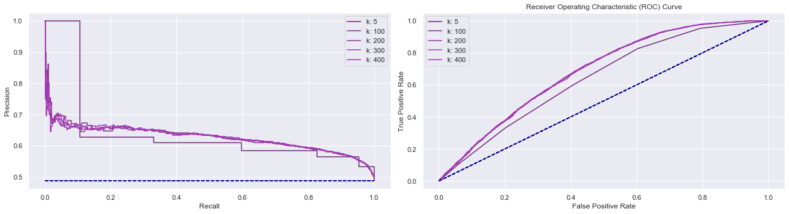

We found a quick drop as the threshold (i.e. probability threshold to assign a positive label) was lifted above 0 and the common slow descend to 0.5 as the threshold approaches 1. The best performing number of estimators was 300 with a Precision Score of 0.61 and a Recall Score of 0.68. This means that we've detected almost 70% of all Hits in the data set and of the songs assigned a Hit label we were correct 61% of the time.

|           | Non-Hit     | Hit         |
|-----------|-------------|-------------|
| accuracy  | -           | 0.635704    |
| logloss   | -           | 0.634130    |
| precision | 0.663376    | 0.612533    |
| recall    | 0.589084    | 0.684854    |
| f1 beta=1 | 0.624026    | 0.646678    |
| support   | 3536.000000 | 3354.000000 |

##### k-Nearest Neighbor

The second algorithm was the K-Nearest Neighbor algorithm tested with up to 1500 neighbors (only 500 visualized here).

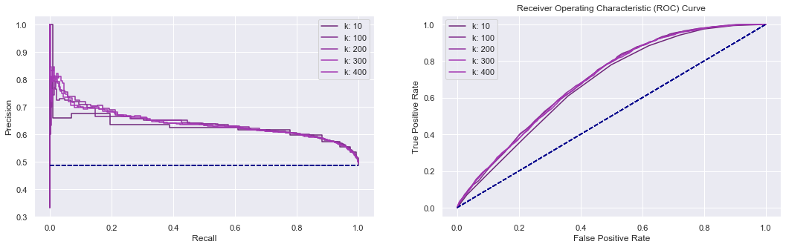

With k-Nearest Neighbor (kNN) we're seeing a more gradual descend with raising the threshold. The best performing k for neighbors is 200. While kNN is performing slightly worse in terms of Precision (0.6) it makes more than up for it in Recall (0.83). kNN was able to retrieve more than 80% of all Hits in the data set, it wins over Random Forest by a huge margin of 15 points.

|           | Non-Hits    | Hits        |
|-----------|-------------|-------------|
| accuracy  | -           | 0.644848    |
| logloss   | -           | 0.617462    |
| precision | 0.745160    | 0.597130    |
| recall    | 0.468043    | 0.831246    |
| f1 beta=1 | 0.574952    | 0.695002    |
| support   | 3536.000000 | 3354.000000 |

#### Validation

To understand how well our model is going to perform outside our training data we're now going to validate our model by using it to predict on the hold-out set. 

Drastic departures of the performance above would indicate issues in our methodology (i.e. data contamination, overfitting etc.)

|           | Non-Hits    | Hits        |
|-----------|-------------|-------------|
| accuracy  | -           | 0.658790    |
| logloss   | -           | 0.613059    |
| precision | 0.752741    | 0.614714    |
| recall    | 0.478236    | 0.841251    |
| f1 beta=1 | 0.584881    | 0.710359    |
| support   | 5169.000000 | 5115.000000 |

k-Nearest Neighbor is performing slightly better across the board but isn't departing drastically from the evaluation metrics in the test set. Overall it looks like we've created a pretty reliable model to detect Hits.

#### Conclusion

 Despite its drawbacks, dubious scalability and processing time, kNN won over Random Forest due to its ability to retrieve significantly more Hits from the data set than Random Forest.

Being correct 60% of the time might not look like much but we shouldn't forget that this model isn't including any external factors and is judging a song exclusively by its internal features. There's likely still room for improvement but this will be conducted in future iterations. We now have a great starting point for creating a stable Hit predictor, the app built on top of this model will show whether it can hold up under real conditions.

# 7. Conclusion

This project has dug into the History of the Hot 100. We've explored the most successful songs on the charts and songs that showed extremes in their audio features.

It also has uncovered changes in the Formula and how it has impacted songs on the Hot 100. It has cast some serious doubt on whether the Hot 100 is as reliable an indicator for popularity as its common usage in scientific research would suggest.

With the exploration of audio features we've discovered that common trends such as the rise in Disco and EDM or format changes to longer songs are also reflected in the features. This confirmed our assumption that we might be able to successfully describe the content (at least partially) using these audio descriptors.

Beyond that we were also able to show that these descriptors have significant correlations with a song's chance to make it onto the Hot 100 and reaching quite respectable results with ~60% Precision and ~80% Recall.

Time will show whether our model can continue to perform at these levels. We'll try to live up to Nate Silver's mantra of being 'less and less and less wrong' by iterating repeatedly over our model to make incremental improvements.

#### What comes next?

- As we've seen the Hot 100 might not be the ideal candidate to gauge popularity. It's formula is prone to change and changes in the formula tend to drastically impact the ability for songs to get onto the Hot 100 and stay on the Hot 100. A tool to gauge popularity more uniformly might be simply using sales and streaming data. Especially when we're attempting to solve a business problem this might make the most sense. The challenge here is that this is often proprietary data and not easy to access. For some initial exploration of this approach data gathered by [kworb.net](https://kworb.net/cc/) might be a viable option.
- The approach to only use content-based features has clear limits as it is ignoring the reality that Marketing, Fan-base and Brand-Presence does play a vital role in the entertainment and music industry. Adding meta data on the songs and possible artist data to the predictions would allow to paint a more accurate picture.
- Another interesting approach to improve predictability is the use of a Network approach. Using social media posts, blog mentions, press clippings etc. might allow us to gauge the popularity of an artist before it makes it onto the Hot 100. One issue with this approach might be that this data won't actually be available until a song is already released. 

# 8. Resources

Bischoff, K., Firan, C. S., Georgescu, M., Nejdl, W., & Paiu, R. (2009). Social Knowledge-Driven Music Hit Prediction, 43-54.

Li, T. (2011). Music data mining. New York: CRC Press.

Ni, Y., Santos-Rodríguez, R., Mcvicar, M., & De Bie, T. (n.d.). Hit Song Science Once Again a Science?.

Nunes, J. C., Ordanini, A., & Valsesia, F. (2015). The power of repetition: repetitive lyrics in a song increase processing fluency and drive market success. Journal of Consumer Psychology, 25(2), 187-199.

Serrà, J., Corral, Álvaro, Boguñá, M., Haro, M., & Arcos, J. L. (2012). Measuring the Evolution of Contemporary Western Popular Music. Sci Rep, 2(1). 

Ward, M. K., Goodman, J. K., & Irwin, J. R. (2014). The same old song: The power of familiarity in music choice. Mark Lett, 25(1), 1-11.